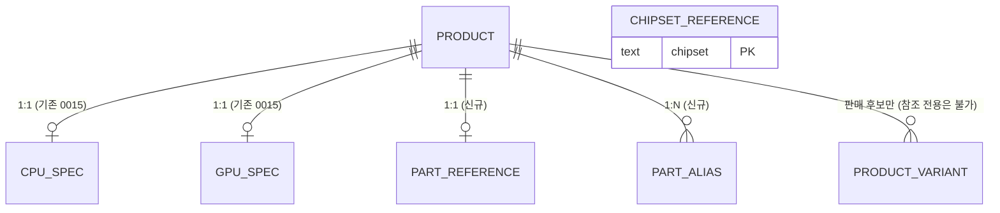

# 참조 스펙 테이블 스키마 초안 (v0.1)

작성일: 2026-09-21 · 상태: **초안 — 팀 검토용** (미확정, 마이그레이션 체인에 넣지 않음)
관련 파일: [`db/drafts/part_reference_draft.sql`](../../db/drafts/part_reference_draft.sql) · [`db/drafts/part_reference_sample.sql`](../../db/drafts/part_reference_sample.sql) · [수집 템플릿](templates/)

## 1. 한 줄 요약

카탈로그(판매 후보)에 없는 **구형·단종 CPU/GPU의 스펙**을 담는 저장소가 없어서, 업그레이드에서 사용자가 "그대로 쓰는 부품"의
호환을 거의 검사하지 못한다. **새 스펙 테이블을 만들지 않고** 기존 `catalog.product` + `cpu_spec`/`gpu_spec`을 재사용하며, 그 위에
**작은 테이블 3개**(참조 메타 · 별칭 · 칩셋 사전)와 **뷰 2개**만 더하는 안을 제안한다.

## 2. 왜 필요한가

업그레이드 모드(고른 부품만 견적 → 나머지는 사용자가 유지)는 유지 부품의 소켓·전력·길이로 호환을 검사한다. 사용자가 적는
유지 부품은 구형이 많은데 카탈로그는 CPU 40개 · GPU 43개뿐이다.

| 사용자가 적은 표기 | 현재 결과 |
|---|---|
| i5-8400, Ryzen 5 3600, Ryzen 5 5600 | **소켓만** 이름 규칙으로 추정(전력·메모리는 모름) |
| GTX 1060, RTX 2060, RX 580 | **전부 모름** (소비전력·권장 파워·길이) |
| B450, B550 보드 | 소켓은 칩셋 규칙으로 추정 |

- 소켓은 제품명 규칙(세대·칩셋)으로 풀었다 — 카탈로그 CPU 40개에서 정확 40 / 틀림 0.
- **전력·길이는 같은 세대 안에서도 모델마다 달라 규칙으로 못 읽는다 → 데이터가 필요하다.** 이 문서가 그 데이터의 그릇이다.

## 3. 범위

**담는 것** — CPU · GPU (칩셋 단위) · 칩셋 사전
**안 담는 것** — 메인보드 · RAM · PSU · 케이스 · 쿨러 · 저장장치 (SKU가 너무 많고 호환에 필요한 값이 칩셋·종류·용량으로 충분하다)

| 대상 | 이유 | 대략 규모(추정) |
|---|---|---|
| CPU (Intel 6~14세대, Ryzen 1000~7000 데스크톱) | 소켓·TDP·메모리·내장 그래픽 필요 | 200~250행 |
| GPU (GTX 900/10/16, RTX 20/30/40, RX 400/500/5000/6000/7000) | 소비전력·권장 파워·길이 필요 | 100~120행 |
| 칩셋 사전 (AM4/AM5, LGA1151~1851) | 보드 이름 → 소켓·메모리 | 약 40행 |

> 규모는 세대 × 모델 수로 **제가 잡은 추정**이며, 수집 범위(§9 결정 2)에 따라 달라진다.

## 4. 설계안 비교

| 안 | 내용 | 장점 | 단점 | 판단 |
|---|---|---|---|---|
| **A. 기존 재사용 + 작은 테이블** | `product`+`cpu_spec`/`gpu_spec`에 참조 부품을 넣고 메타·별칭·칩셋만 추가 | 새 스펙 컬럼 0개 · 기존 JOIN 관례와 일치 · 후보 로더가 자동으로 제외 | `product`에 판매 안 하는 행이 섞임(가드로 관리) | **채택 제안** |
| B. 별도 스키마 `reference.*` | 스펙 테이블을 통째로 복제 | 판매 카탈로그와 완전 분리 | 컬럼 중복 · 로더·시드 이중 유지 | 비추천 |
| C. 단일 JSONB 테이블 | 스펙을 JSONB로 | 유연 | 타입 안전 비교 불가(0015에서 EAV를 버린 이유와 동일) | 비추천 |

## 5. 스키마

### 5.1 `catalog.part_reference` — 참조 메타 (신규, product와 1:1)
| 컬럼 | 타입 | 설명 |
|---|---|---|
| product_id | uuid PK, FK | `catalog.product(id)` |
| reference_only | boolean | true = 가격·판매처 없는 스펙 전용(추천 후보 아님) |
| generation | text | 표시·필터용 (`Intel 8th`, `Ryzen 3000`, `GeForce 10`) |
| release_year | smallint | 2000~2100 |
| spec_confidence | text | `verified`(실물·복수 출처) / `vendor_spec`(제조사 공개 사양) / `estimated`(추정) |
| source_url · source_note | text | 스펙 근거 (**필수**) |
| verified_at · verified_by | date · text | 확인일 · 확인자 (**필수: verified_at**) |

### 5.2 `catalog.part_alias` — 이름 별칭 (신규)
사용자는 "GTX1060", "지포스 1060", "라이젠 5 3600"처럼 쓴다. `alias_norm`(소문자·영숫자·한글만, **자동 생성**)으로 **정확 일치**
조회한다. 공백·하이픈만 다른 별칭은 같은 키라 하나로 합쳐진다(적재 시 `ON CONFLICT DO NOTHING`).

### 5.3 `catalog.chipset_reference` — 칩셋 사전 (신규)
`chipset`(PK) · `vendor` · `socket` · `memory_types text[]` · `release_year` · `source_url` · `note`.
`memory_types`가 2개 이상(LGA1700 등 보드마다 DDR4/DDR5)이면 소켓만 확정한다. 현재 코드(`owned_parts._CHIPSET_SOCKET`)에 박혀 있는
규칙표를 데이터로 옮겨 **코드 수정 없이 갱신**하려는 것이다.

### 5.4 재사용하는 기존 컬럼 (변경 없음)
| 테이블 | 컬럼 | 참조 부품에서의 쓰임 |
|---|---|---|
| `catalog.product` | brand · model · name · product_type · `status='discontinued'` | 부품 식별 |
| `catalog.cpu_spec` | socket · tdp_w · memory_type · integrated_graphics · spec_url · sale_status · status_checked_at · note | CPU 스펙·근거 |
| `catalog.gpu_spec` | power_w · recommended_psu_w · length_mm · **spec_basis**(자유 텍스트) · spec_url … | GPU 스펙·근거 |

> GPU 길이는 제조사 카드마다 다르다. 팀이 이미 `gpu_spec.spec_basis`에 "Founders Edition 기준", "제조사 모델별 크기 확인 필요" 식으로
> 기록하고 있어, **`length_mm`에는 최대값(보수적)을 넣고 범위·근거는 `spec_basis`에 적는** 관례를 그대로 따른다
> (예: `제조사 카드별 길이 상이(190~290mm), 최대값 기재`). 새 컬럼을 만들지 않는다.

### 5.5 뷰
- `catalog.part_lookup_v` — 판매 후보와 참조 부품(CPU·GPU)을 **한 모양**으로 낸다. 컬럼 이름이 기존 로더(`catalog_repo._specs_from_row`)가 읽는
  이름과 같아 로더 변경이 최소다.
- `catalog.part_reference_issues_v` — 규칙을 어긴 행을 찾는 점검 뷰(**비어 있어야 정상**): 스펙 행 없음 · CPU 소켓 없음 ·
  GPU 소비전력·권장 파워 둘 다 없음 · 범위 밖 유형 · 판매 후보인데 reference_only.

### 5.6 무결성 규칙
- 참조 전용(`reference_only=true`) 부품에는 **`product_variant`를 만들 수 없다**(트리거). 반대로 이미 variant가 있는 상품은 참조 전용으로 표시할 수 없다.
- 가격 없는 상품은 후보 로더가 `variant`·`offer`를 조인하므로 **자동으로 추천 후보에서 빠진다.**
- `spec_confidence` 값 제한 · 출처 URL·확인일 필수 · `alias_norm` 중복 금지.

## 6. 엔진 연동 (이 초안에서는 미반영)

유지 부품 이름 → 스펙 해석 순서를 아래처럼 확장한다(각 단계가 실패하면 다음 단계, 끝까지 못 읽으면 "확인 안 됨").
1. **별칭 정확 일치** (`part_alias.alias_norm`) — `GTX1650`, `라이젠 5 3600`처럼 토큰 매칭이 못 찾는 표기
2. **카탈로그 + 참조 토큰 매칭** (기존 `_match_catalog`, `part_lookup_v`를 후보 풀로)
3. **이름 규칙 추정** (기존: CPU 세대 · 보드 칩셋 → 소켓)

코드 변경은 로더 함수 1개(뷰 읽기) · `resolve_owned_parts`에 풀 인자 · `source` 라벨에 `reference`(신뢰도 표시) 정도다.
`estimated` 신뢰도 값은 결과 화면의 "확인이 필요한 것"에 기존 추정 안내와 같은 방식으로 밝힌다.

## 7. 데이터 수집

수집 템플릿: [`docs/db/templates/`](templates/) (CPU · GPU · 칩셋 CSV, 헤더 + 예시 1행).
- **필수**: 소켓/전력/권장 파워 등 호환 값 · `source_url` · `verified_at` · `spec_confidence`
- **모르면 비운다** — 추정값으로 채우지 않는다(`estimated`는 "확인 전 임시"이고 결과 화면에 그렇게 표시된다).
- **검증**: 수집자와 다른 사람이 표본(예: 10%)을 원문으로 재확인한다.
- **원본 파일은 저장소에 커밋하지 않는다**(기존 정책: 원본 데이터는 로컬 보관, 수집 스크립트만 관리).
- **출처 정책은 결정이 필요하다**(§9 결정 3): 제조사 공식 사양 페이지는 사실 값 확인용으로 쓰기 쉽지만, 제3자 DB를 통째로 옮기는 것은
  약관·라이선스 확인 전에는 피한다(이 프로젝트가 외부 데이터셋 파생물의 라이선스 미확인을 이미 한 번 문제 삼았다).

## 8. 예시 10행 (검증 전 — 적재 대상 아님)

형식과 스키마 동작을 확인하려는 예시이며 값은 **전부 `estimated`, 원문 확인 전**이다.

| 유형 | 모델 | 세대 | 소켓/전력/권장 파워/길이 |
|---|---|---|---|
| CPU | Core i5-8400 | Intel 8th | LGA1151 · 65W · DDR4 |
| CPU | Core i7-9700K | Intel 9th | LGA1151 · 95W · DDR4 |
| CPU | Core i5-10400F | Intel 10th | LGA1200 · 65W · DDR4 |
| CPU | Ryzen 5 3600 | Ryzen 3000 | AM4 · 65W · DDR4 |
| CPU | Ryzen 5 5600 | Ryzen 5000 | AM4 · 65W · DDR4 |
| GPU | GeForce GTX 1060 6GB | GeForce 10 | 120W · 권장 400W · 길이 최대 290mm |
| GPU | GeForce GTX 1650 | GeForce 16 | 75W · 권장 300W · 길이 최대 230mm |
| GPU | GeForce RTX 2060 | GeForce 20 | 160W · 권장 500W · 길이 최대 300mm |
| GPU | Radeon RX 580 | Radeon RX 500 | 185W · 권장 500W · 길이 최대 290mm |
| GPU | Radeon RX 5700 XT | Radeon RX 5000 | 225W · 권장 600W · 길이 최대 320mm |

## 9. 결정이 필요한 것

| # | 결정 | 제안 |
|---|---|---|
| 1 | **재사용(A) vs 분리(B)** — 판매 안 하는 행을 `catalog.product`에 넣어도 되는가 | A. 이유: 후보 로더가 자동 제외 + 가드 트리거. `product`를 직접 읽는 다른 코드는 조회(brand+model, model) 용도라 영향이 작다고 보지만 **각 담당자 확인 필요** |
| 2 | **수집 범위** — 어느 세대까지 | 최근 8~10년 인기 모델부터(Intel 6~14세대, Ryzen 1000~7000, GTX 900 이후) — 판매 데이터가 있으면 그 기준 |
| 3 | **출처 정책** — 제조사 공식 페이지만 vs 제3자 DB 허용 | 제조사 공식 우선, 제3자는 라이선스 확인 후 |
| 4 | **GPU 길이** — 최대값 기재로 충분한가, 범위를 컬럼으로 둘까 | 최대값 + `spec_basis` 텍스트(기존 관례). 범위 분석이 필요해지면 그때 컬럼 추가 |
| 5 | **칩셋 사전을 데이터로 옮기는 것** — 코드 규칙표 유지 vs 테이블 | 테이블 (코드 수정 없이 갱신) — 단 초기에는 코드 규칙을 폴백으로 유지 |
| 6 | **위치·번호** — `0017_*.sql`로 확정할 시점, 시드 파일 위치 | 결정 1·2 확정 후 |
| 7 | **담당·일정** — 수집·검증 인력과 기한 | (팀 논의) |

## 10. 검증 내역

임시 DB(`truefit_refdraft`)에 마이그레이션 0000~0016을 적용한 뒤 초안을 실행해 확인했다(2026-09-21).
- 초안 DDL · 예시 10행 적재: 오류 없음
- `part_lookup_v` 10행, `part_reference_issues_v` 0행(정상)
- 무결성: 참조 전용 부품에 variant 생성 **차단** · 없는 product 참조 차단 · 잘못된 신뢰도 값 차단
- 후보 로더와 같은 조인(`variant`·`offer`)에서 참조 부품 **0건**(추천 후보에 안 섞임)
- 엔진 프로토타입(저장소 미반영): 지금 "확인 안 됨"인 GTX 1060 · RTX 2060 · RX 580 · GTX1650 · i5-8400 · Ryzen 5 3600 · `라이젠 5 3600`이
  소비전력·권장 파워·길이·소켓·TDP까지 해석됨. 예시에 없는 GTX 1070은 여전히 확인 안 됨 → **데이터를 채운 만큼만 효과가 난다.**
- 검증 중 발견해 반영: `RX5700XT`와 `RX 5700 XT`는 같은 `alias_norm`이라 중복으로 막힘 → 적재 시 `ON CONFLICT DO NOTHING`으로 규칙화.
  기존 `gpu_spec.spec_basis`와 겹치는 새 컬럼(`spec_basis`, 길이 범위)을 빼고 기존 관례를 재사용.

## 11. 리스크 · 아직 안 한 것

- **데이터 정확도**: 값이 틀리면 잘못된 호환 판정으로 이어진다 → 출처·확인일·신뢰도 필수, 모르면 비움, 표본 재검증.
- **`catalog.product` 오염**: 참조 행이 늘면 카탈로그 통계·관리 화면이 섞일 수 있다 → `reference_only` 필터·점검 뷰. (다른 코드의 영향은 결정 1에서 확인)
- **유지 비용**: 신제품이 계속 나온다 → 참조는 "단종·구형 고정 범위"로 한정하고 현행 부품은 판매 카탈로그에서 관리.
- **아직 안 한 것**: 엔진 코드 반영 · 시드/임포터 · 실제 데이터 수집 · 프론트 표시 · 마이그레이션 번호 확정 · 테스트.

## 12. 다음 단계

1. 이 문서로 결정 1~3 합의 (검토 요청)
2. 합의 후 `0017` 마이그레이션 + 임포터(CSV → 4개 테이블) + 로더/해석기 반영 + 테스트
3. 데이터 수집 착수 (우선순위: 인기 세대 → 나머지)
