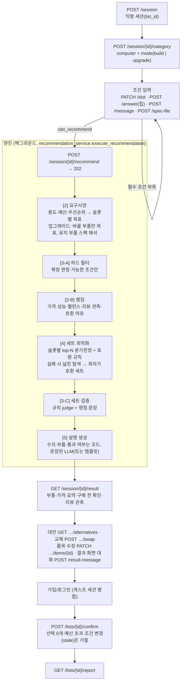

# PC 추천 파이프라인 — 흐름과 현재 상태

브랜치 `pc-catalog-engine`, 2026-09-21 기준. 재현 절차는 [pc_pipeline_quickstart.md](pc_pipeline_quickstart.md),
테스트 현황은 [test_status.md](test_status.md).

## 한 줄 요약

**큰 파이프라인은 끝까지 이어진다** — 조건 대화 → 추천 → 결과 → 대안·교체 → 확정 → 리포트가 신규 조립과 업그레이드
모두 HTTP로 통과한다(`scripts/e2e_smoke.py` 39/39). 세부(참조 스펙 데이터, 교체 뒤 전체 재검증, 실제 LLM 검증 등)는 아래
[미완 목록](#미완-목록)에 있다.

## 흐름

- 조건 필수 항목: 신규 조립 = 용도·예산·우선순위, 업그레이드 = 여기에 바꿀 부품. 업그레이드에서 사양 파일에 없는 유지 부품
  정보(플랫폼·RAM 종류·파워 용량)는 필요한 경우에만 칩 질문으로 묻는다(`config/categories/computer.yaml`의 `ask_when`).
- 추천은 비동기(202 후 폴링)다. `[2]~[4]+검증`과 `[5]` 설명은 별도 트랜잭션이라 부품표가 문장보다 먼저 보인다.

## 규칙·설정이 있는 곳

| 무엇 | 어디 |
|---|---|
| 조건 스키마·질문 | `config/categories/computer.yaml` |
| 용도별 기본값, 성능 티어, 우선순위 가중치, 소음 프록시, 전력 헤드룸·권장 파워 규칙 | `config/computer_verification_rules.yaml` (`rule_set_version: computer-rules-v5`) |
| 요구사양(용도 프로필·업그레이드 목표 제한) | `src/engine/stage2_requirement.py` |
| 유지 부품 스펙 해석·업그레이드 안내문 | `src/engine/owned_parts.py` |
| 호환 규칙(소켓·메모리·폼팩터 계층·전력·GPU 권장 파워) | `src/engine/stage4_optimize.py` (`_pc_known_failures`) |
| 후보 로딩(DB → 후보) | `src/repo/catalog_repo.py` |
| 대안 목록의 호환 필터 | `src/services/recommendation_service.py` (`_drop_incompatible_alternatives`) |
| 확정 규칙 | `src/services/list_service.py` (`confirm`) |
| 새 프론트(React) · API 연결 | `web/` — 연결은 `web/src/api/http/`, 서빙은 `src/frontend_serving.py` |
| 파이프라인 점검 | `scripts/e2e_smoke.py`, `tests/test_pipeline_http_smoke.py`(HTTP 3개 흐름), `tests/test_pipeline_smoke.py`(엔진 목 시나리오) |

## 이 파이프라인이 지키는 것 (테스트로 고정됨)

- 모르는 것을 호환 불가로 단정하지 않는다 — 스펙을 못 읽은 부품은 "확인 못 함"으로 안내하고 실패로 세지 않는다.
- 업그레이드에서 유지 부품은 견적에 넣지 않고, 소켓·메모리·크기·전력 호환 검사에만 쓴다.
- 대안 목록에서 현재 구성과 확정적으로 안 맞는 후보(소켓·메모리·크기·전력)는 뺀다.
- 결과 항목이 있어도 선택이 0개이면 확정할 수 없다(`no_items_selected`). 예산 초과·조건 변경 뒤 확정도 거절.
- 재확정은 거절이 아니라 같은 리포트를 돌려준다(멱등) — 이벤트(`plan_confirmed`)는 늘지 않는다.
- 테스트는 이름에 `test`가 든 DB에만 접속한다(개발 DB 보호).

## 미완 목록

우선순위 = 공유 뒤 다음으로 할 순서. **P2 = 이번 공유 범위 밖(알고 있는 한계)**.

### 데이터

| 항목 | 상태 | 영향 |
|---|---|---|
| 참조 스펙 테이블(카탈로그에 없는 구형 부품의 스펙) | 스키마 **초안만** ([db/drafts/](../db/drafts/part_reference_draft.sql), [설명](db/part_reference_schema_draft.md)). 마이그레이션·적재 스크립트 없음 | 업그레이드에서 유지하는 구형 부품은 이름 규칙으로 소켓만 추정. 전력·권장 파워는 알 수 없어 "확인 못 함" |
| 가격 이상치 점검 | 점검 도구만 있다(`scripts/check_price_outliers.py`, 읽기 전용 · 같은 등급 중앙값 대비 배수). 2026-09-21 실행: 후보 4건 — Radeon RX 6750 XT 2,950,000원(같은 등급의 3.1배), RTX 6000 Ada 11,851,340원(워크스테이션이라 정상일 수 있음), TeamGroup CX2 23,980원. **원본 대조와 수정·제외는 미수행** — 데이터 소스 확인이 필요하다 | 비정상 가격이 추천에 들어갈 수 있음 |
| 원본 데이터 전달 | xlsx·CSV와 리뷰 관측 산출물(`data/amazon23/pcparts_product_risk.json`)은 Git에 없음 | 새 체크아웃은 파일을 따로 받아야 재현 가능. 리뷰 산출물이 없으면 추천은 되지만 리뷰 관측 축이 꺼진다 |
| 부속기기(마우스·모니터·스피커·키보드) | DB 적재까지만 | 추천 엔진과 화면에 연결 안 됨 |

### 엔진

| 항목 | 상태 |
|---|---|
| 교체(swap)·담기/빼기·수량 변경 뒤 세트 재검증 | **반영(2026-09-21)** — `reverify_set`이 지금 선택된 부품으로 같은 호환 점검(`stage4.pc_link_check`)과 문장화를 다시 돌려 저장된 검증을 바꾼다. 순위·요약 문장은 다시 만들지 않는다(교체 전 기준) |
| 호환 검사 — 쿨러 소켓·BIOS 축 | **수정(2026-09-21, 규칙 v7)** — 쿨러 지원 소켓 표기("LGA1851/1700/1200/115x, AM5/AM4")를 풀어서 비교한다(전엔 문자열 포함이라 LGA1700 CPU와 맞는 쿨러 10종이 비호환으로 오판됐다). BIOS 축은 CPU 이름의 세대·계열(`src/engine/compat_parse.py`)이 메인보드의 지원 CPU 계열에 있는지로 판정한다 — 있으면 ok, 없으면 확정 비호환, 이름을 못 읽으면 "근사". **출고 BIOS 버전은 데이터에 없어 여전히 모른다**(보드 사용 가이드가 안내). 카탈로그 CPU·보드 조합은 전부 계열이 맞아서 신규 조립에서는 판별력이 없고, 업그레이드에서 옛 CPU(Ryzen 2000 번대 등)를 유지할 때 의미가 있다 |
| 호환 검사 — 파워 폼팩터·GPU 전원 커넥터 | **추가(2026-09-21, 규칙 v8)** — 파워 폼팩터(ATX·SFX·SFX-L)가 케이스가 지원하는 파워 크기에 드는가: 더 큰 파워는 **확정 비호환**(ATX 파워×SFX 전용 케이스 7종, 카탈로그 1600쌍 중 273쌍이 이전에 통과되던 것), 더 작은 파워는 어댑터 필요(확인 필요). GPU 보조 전원 커넥터를 파워가 제공하는가: 16핀 GPU×8핀 파워는 동봉 어댑터가 필요해 **확인 필요**(1720쌍 중 96쌍), 확정 비호환으로는 보지 않는다. 케이블 개수("2× 8-pin")는 데이터에 없어 확인하지 않는다 |
| 호환 검사 — 확장 열 검사(규칙 v9, 마이그레이션 0018) | **구현(2026-09-22)** — 원본 엑셀의 새 열을 DB(`0018`)·시드·로더로 연결하고 검사를 추가했다: **GPU 전원 커넥터 개수**(파워 PCIe 8핀·16핀 개수, `1× 16-pin 또는 2× 8-pin` 같은 대안 표기 포함), 파워 길이↔케이스, GPU 두께(올림한 슬롯 수)↔케이스 확장 슬롯, 수랭 라디에이터↔케이스(전면·상단·후면), RAM 모듈 수·총용량↔메인보드 DIMM 슬롯·최대 용량, RAM 속도↔메인보드 최대 속도(넘으면 비호환이 아니라 낮은 속도로 동작), M.2 SSD↔메인보드 M.2 슬롯·PCIe 세대. 전력 검사는 CPU **최대 전력(PL2/PPT)** 이 있으면 TDP 대신 쓴다(현재 Intel 19종만). **2026-09-22에 Codex 데이터 B1(파워)·B2(케이스)·B4(GPU 길이·높이)·B5(메인보드 슬롯·메모리·M.2)를 병합해 전부 켜졌다** — 실제 카탈로그 조합에서 파워 길이 ok 1055/fail 240/데이터 없음 305, GPU 두께 fail 26, 수랭 라디에이터 fail 217, RAM 속도 초과 178, M.2 세대 낮음 225쌍이 판정된다. 케이스 3종(A4-H2O·EH1-GEO·T1 V2.1)은 파워 길이가 비어 "확인 못 함"으로 남는다(B12에서 DLM21 RGB Mesh 210mm를 2차 출처로 채웠고, DF2100 Mesh는 다나와의 230~400mm 범위 중 보수적으로 300을 넣었다). Antec FLUX Pro 파워 길이는 제조사 최대값(470)이 아니라 보수적으로 300을 넣었다 |
| 호환 검사 — 데이터가 없을 때 | 새 검사에서 값이 비어 못 본 것은 화면 "검사 상세"에는 "확인 못 함"으로 보이지만 **감점·"확인 못 한 항목"으로 세지 않는다**(값이 채워지면 판정이 되고, 값이 있어서 나온 경고는 그대로 센다). 개수를 모르는 파워는 케이블 개수로 실패를 단정하지 않는다 |
| [3-B] 랭킹 — 검사용 스펙이 빈 후보 감점(규칙 v10) | **구현(2026-09-22)** — 성능 등급이 없는 슬롯(케이스 등)은 점수가 가격 하나로만 갈려서 항상 가장 싼 부품이 뽑혔고(케이스는 45회 모두 같은 한 종, 그 케이스는 파워 길이 데이터가 없어 검사가 "확인 못 함"으로만 나왔다), "정보 없음은 통과" 원칙 때문에 데이터가 빈 싼 부품이 검사를 피해 갔다. 이제 검사에 필요한 스펙(케이스: 파워 길이·확장 슬롯·GPU 길이·쿨러 높이, 파워: 길이·8핀 개수, 메인보드: DIMM·최대 메모리·M.2, GPU: 길이·두께)이 비어 있으면 스펙 1개당 0.10(상한 0.20)을 깎는다. 그 열이 슬롯에서 아무도 값이 없으면 감점하지 않고, 값이 채워지면 자동으로 사라진다. 결과: 케이스 1종 → 3종, 파워 길이가 실제로 판정되는 견적 0/18 → 9/18 |
| 호환 검사 — 아직 안 보는 것 | 출고 BIOS 버전(최소 BIOS 열 B6 대기), CPU-RAM 방열판 높이↔쿨러 간섭(쿨러 쪽 RAM 여유 데이터 없음), SATA 포트 수, GPU 높이↔케이스(케이스 높이 열 없음) |
| 호환 검사 — 이번 견적에서 안 바뀌는 부품 | 업그레이드에서 바꾸지 않는 부품 사이의 검사는 "확인 못 함"으로 세지 않고 건너뛴다(GPU만 바꾸는데 CPU 소켓 근사가 뜨던 것). 결과 상세에는 "건너뜀"으로 남는다 |
| 세트 검증 `[3-C]` | 규칙 스캐폴드(RAG 근거 미연결). 신뢰도 점수는 화면에 노출하지 않는다 |
| 내장 그래픽(iGPU) 조립 | 미지원 — GPU 슬롯은 항상 채운다 |
| `games` 조건 | **반영(2026-09-21)** — `config/computer_verification_rules.yaml`의 `game_titles`(15개 제목)가 해상도 요구와 요소별 최댓값으로 최소 등급을 올린다(용도가 게임일 때만). **표의 숫자는 잠정값**(배급사 권장 사양을 라인업 등급에 거칠게 옮김, 팀 확인 전). 표에 없는 게임은 해상도 기준 그대로이고 결과 화면에 안내가 붙는다. 랭킹(점수)에는 아직 안 쓴다 |
| 성능 우선일 때 예산 상한 | 예산 안에서 점수 합을 최대화할 뿐, 예산을 얼마나 남길지(상한 여유) 정책은 미정 |
| 최적화 범위 | 슬롯별 top-N(CPU·GPU 5, 나머지 3) 안에서만 최적. 실패하면 전체 후보로 넓혀 탐색 후 최저가 호환 세트 |

### LLM·에이전트

| 항목 | 상태 |
|---|---|
| 실제 LLM 검증 | **1회 수행(2026-09-21, gpt-4o-mini, 신규 조립·업그레이드 각 1건)** — 호출·구조화 출력·규칙 검사가 끝까지 동작했다(신규 조립 9~18초). 이 검증에서 찾아 고친 것: 근사 축마다 LLM이 "근거는 제공되지 않았습니다"만 되풀이하던 쟁점 문장 → 코드가 쓰는 고정 안내로, 실제 임베딩 검색이 RAM에 SSD 가이드·GPU에 케이스 가이드를 붙이던 것 → 슬롯 안에서만 검색. **남은 관찰(미조치)**: 요약에 입력에 없는 "RAM에서 약간의 타협" 같은 표현이 나온 적이 있고, 추천 이유에 순위("1순위")가 반복된다. 자동 테스트·스모크는 여전히 `MOCK_MODE=1` |
| 조건/결과 대화 에이전트(Strands) | 기본 꺼짐(규칙 경로가 기본) |

### 프론트 (`web/`, React) — 연결 현황

| 화면·기능 | 상태 |
|---|---|
| 로그인·회원가입 | **백엔드 연결**. 상단바에 로그인한 사용자(이름·이메일)와 로그아웃 버튼이 보인다(시작할 때 `/auth/me` 확인). 로그인 상태 표시는 화면에서 직접 확인하지 못했다(계정 생성을 하지 않는 규칙) |
| 조건 대화 → 분석 → 8개 부품 구성 | **백엔드 연결**(`plans.recommend`). 대화 문장은 화면 안 목업 문구, 조건은 추천 요청 때 한 번에 서버로 보낸다 |
| 확정 · 리포트 · 내 목록 · 삭제 | **백엔드 연결**. 확정은 로그인이 필요하다(비로그인이면 로그인 버튼 → 돌아오기) |
| 채팅 후속 질문 | **백엔드 연결(구성이 나온 뒤)** — `POST /session/{id}/result-message`. "그래픽카드 더 저렴한 걸로"처럼 부품을 바꾸라는 말은 한 단계 옆 후보로 바꾸고(호환 안 되는 후보 제외) 바뀐 구성을 화면에 반영한다. 근거를 묻는 말은 받아 둔 추천 이유로 화면에서 답한다. 인터뷰 문답(목적·성능 질문)은 화면 안 정해진 문답 |
| 견적 점검 화면(`/check`) | **부분 연결** — 업그레이드 제안 카드는 서버의 업그레이드 추천 결과다(가격·부품·호환 안내). 성능 향상 폭·소비전력은 서버가 계산하지 않아 비워 둔다. 점검 표의 부품 목록은 여전히 샘플이고 직접 수정해야 하며(제품 매칭·사양 파일 업로드 API 없음), 점검 화면의 추가 질문 대화(`reviewReply`)는 목업 |
| 구매 전 확인 · 호환성 점검 | **화면 표시** — 결과 화면에 세트 호환 점검 요약(확정된 문제는 강조, 확인 못 한 항목은 접힘), 추천 근거 패널에 부품별 "호환성 · 구매 전 확인" 카드, 그리고 **"검사 상세 보기"**: 서버가 지금 선택된 부품으로 계산한 검사별 결과(통과·확인 못 함·문제·건너뜀)와 무엇을 무엇과 비교했는지(`compat_checks`, 교체·채팅 뒤에도 현재 구성을 따라간다) |
| 책상 치수 · 점검 초안 · 입력한 조건 문장 | 서버에 필드가 없어 **이 브라우저에만** 보관(다른 기기에서는 기본값) |
| 주변기기 · 모니터 | 미지원(엔진이 다루지 않는다) |
| 가격 추이 그래프 · 판매처 링크 | 제거/미연결(서버에 가격 이력·구매 링크 매핑이 없다) |

연결하면서 알려진 한계:
- **결과 화면에서 예산을 바꾸면 새 예산으로 구성을 다시 계산한다**(서버는 조건이 바뀌면 그 추천을 낡은 것으로 보고 확정을 거절한다 — `stale_recommendation`). 직접 바꾼 부품은 새 구성으로 초기화된다.
- 성능 목표는 서버 단계로 근사한다: `QHD 144Hz → QHD_165`, `QHD 60Hz → FHD_144`(초당 화소 처리량 기준). 서버에 그 단계가 없다.
- 업그레이드에서 현재 CPU·GPU를 적었고 카탈로그와 정확히 대응되면 그 등급을 하한으로 걸고 그 제품 자체는 후보에서 뺀다. 못 넘겼거나 같은 등급이면 결과에 안내가 붙는다(등급이 거친 눈금이라 같은 등급은 향상 폭을 알 수 없다).
- 업그레이드에서 유지 부품의 플랫폼·RAM 종류·파워 용량은 묻지 않고 "모르겠어요"로 처리해 추천한다(결과에서 호환성 확인 안내).
- 용도는 입력 문장의 키워드로 정한다(게임/영상·작업/사무/학습, 못 찾으면 "기타").
- 서버 추천이 끝날 때까지 기다린다(최대 60초, 설명 문장은 20초 더).

### 화면·계정·범위 밖

| 항목 | 상태 |
|---|---|
| 옛 정적 프론트(`frontend/`) | 새 프론트(`web/`)가 기본이 되어 대체 경로로만 남는다(`TRUEFIT_FRONTEND=legacy`). 유아용품 카드·영어 전환은 더 이상 동작하지 않는다. 삭제는 미결정 |
| 인증 강화 | 로그인·가입·확정은 동작. 이메일 확인 호출 제한, 5회 실패 잠금, 비밀번호 변경 시 옛 토큰 무효화, 탈퇴 시 동의 시각 삭제는 **테스트 7건이 실패** — 후순위 |
| 유아용품(baby)·영어 화면·달러 입력 | 2026-09-21에 제거(코드·데이터·문서·테스트). 프롬프트 문구도 한국어 전용으로 바뀌었으므로 팀 확인이 필요하다 |
