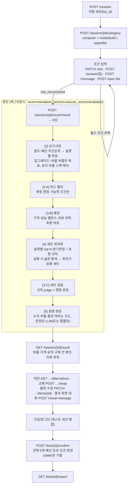

# PC 추천 파이프라인 — 흐름과 현재 상태

브랜치 `pc-catalog-engine`, 2026-09-21 기준. 재현 절차는 [pc_pipeline_quickstart.md](pc_pipeline_quickstart.md),
테스트 현황은 [test_status.md](test_status.md).

## 한 줄 요약

**큰 파이프라인은 끝까지 이어진다** — 조건 대화 → 추천 → 결과 → 대안·교체 → 확정 → 리포트가 신규 조립과 업그레이드
모두 HTTP로 통과한다(`scripts/e2e_smoke.py` 39/39). 세부(참조 스펙 데이터, 교체 뒤 전체 재검증, 실제 LLM 검증 등)는 아래
[미완 목록](#미완-목록)에 있다.

## 흐름

- 조건 필수 항목: 신규 조립 = 용도·예산·우선순위, 업그레이드 = 여기에 바꿀 부품. 업그레이드에서 사양 파일에 없는 유지 부품
  정보(플랫폼·RAM 종류·파워 용량)는 필요한 경우에만 칩 질문으로 묻는다(`config/categories/computer.yaml`의 `ask_when`).
- 추천은 비동기(202 후 폴링)다. `[2]~[4]+검증`과 `[5]` 설명은 별도 트랜잭션이라 부품표가 문장보다 먼저 보인다.

## 규칙·설정이 있는 곳

| 무엇 | 어디 |
|---|---|
| 조건 스키마·질문 | `config/categories/computer.yaml` |
| 용도별 기본값, 성능 티어, 우선순위 가중치, 소음 프록시, 전력 헤드룸·권장 파워 규칙 | `config/computer_verification_rules.yaml` (`rule_set_version: computer-rules-v5`) |
| 요구사양(용도 프로필·업그레이드 목표 제한) | `src/engine/stage2_requirement.py` |
| 유지 부품 스펙 해석·업그레이드 안내문 | `src/engine/owned_parts.py` |
| 호환 규칙(소켓·메모리·폼팩터 계층·전력·GPU 권장 파워) | `src/engine/stage4_optimize.py` (`_pc_known_failures`) |
| 후보 로딩(DB → 후보) | `src/repo/catalog_repo.py` |
| 대안 목록의 호환 필터 | `src/services/recommendation_service.py` (`_drop_incompatible_alternatives`) |
| 확정 규칙 | `src/services/list_service.py` (`confirm`) |
| 새 프론트(React) · API 연결 | `web/` — 연결은 `web/src/api/http/`, 서빙은 `src/frontend_serving.py` |
| 파이프라인 점검 | `scripts/e2e_smoke.py`, `tests/test_pipeline_http_smoke.py`(HTTP 3개 흐름), `tests/test_pipeline_smoke.py`(엔진 목 시나리오) |

## 이 파이프라인이 지키는 것 (테스트로 고정됨)

- 모르는 것을 호환 불가로 단정하지 않는다 — 스펙을 못 읽은 부품은 "확인 못 함"으로 안내하고 실패로 세지 않는다.
- 업그레이드에서 유지 부품은 견적에 넣지 않고, 소켓·메모리·크기·전력 호환 검사에만 쓴다.
- 대안 목록에서 현재 구성과 확정적으로 안 맞는 후보(소켓·메모리·크기·전력)는 뺀다.
- 결과 항목이 있어도 선택이 0개이면 확정할 수 없다(`no_items_selected`). 예산 초과·조건 변경 뒤 확정도 거절.
- 재확정은 거절이 아니라 같은 리포트를 돌려준다(멱등) — 이벤트(`plan_confirmed`)는 늘지 않는다.
- 테스트는 이름에 `test`가 든 DB에만 접속한다(개발 DB 보호).

## 미완 목록

우선순위 = 공유 뒤 다음으로 할 순서. **P2 = 이번 공유 범위 밖(알고 있는 한계)**.

### 데이터

| 항목 | 상태 | 영향 |
|---|---|---|
| 참조 스펙 테이블(카탈로그에 없는 구형 부품의 스펙) | 스키마 **초안만** ([db/drafts/](../db/drafts/part_reference_draft.sql), [설명](db/part_reference_schema_draft.md)). 마이그레이션·적재 스크립트 없음 | 업그레이드에서 유지하는 구형 부품은 이름 규칙으로 소켓만 추정. 전력·권장 파워는 알 수 없어 "확인 못 함" |
| 가격 이상치 점검 | 미수행 (예: RTX 4070 2,697,030원) | 비정상 가격이 추천에 들어갈 수 있음 |
| 원본 데이터 전달 | xlsx·CSV와 리뷰 관측 산출물(`data/amazon23/pcparts_product_risk.json`)은 Git에 없음 | 새 체크아웃은 파일을 따로 받아야 재현 가능. 리뷰 산출물이 없으면 추천은 되지만 리뷰 관측 축이 꺼진다 |
| 부속기기(마우스·모니터·스피커·키보드) | DB 적재까지만 | 추천 엔진과 화면에 연결 안 됨 |

### 엔진

| 항목 | 상태 |
|---|---|
| 교체(swap) 뒤 세트 전체 재검증 | 대안 목록은 호환 필터를 거치지만, 교체 확정 뒤 세트 전체를 다시 검증하지는 않는다 |
| 세트 검증 `[3-C]` | 규칙 스캐폴드(RAG 근거 미연결). 신뢰도 점수는 화면에 노출하지 않는다 |
| 내장 그래픽(iGPU) 조립 | 미지원 — GPU 슬롯은 항상 채운다 |
| `games` 조건 | 조건 스키마에는 있으나 요구사양·랭킹 코드가 읽지 않는다(추천에 반영 안 됨) |
| 성능 우선일 때 예산 상한 | 예산 안에서 점수 합을 최대화할 뿐, 예산을 얼마나 남길지(상한 여유) 정책은 미정 |
| 최적화 범위 | 슬롯별 top-N(CPU·GPU 5, 나머지 3) 안에서만 최적. 실패하면 전체 후보로 넓혀 탐색 후 최저가 호환 세트 |

### LLM·에이전트

| 항목 | 상태 |
|---|---|
| 실제 LLM 검증 | 미수행 — 스모크·테스트는 전부 `MOCK_MODE=1` |
| 조건/결과 대화 에이전트(Strands) | 기본 꺼짐(규칙 경로가 기본) |

### 프론트 (`web/`, React) — 연결 현황

| 화면·기능 | 상태 |
|---|---|
| 로그인·회원가입 | **백엔드 연결**. 화면에 로그인 상태 표시는 없다(상단바는 "방문자" 고정) |
| 조건 대화 → 분석 → 8개 부품 구성 | **백엔드 연결**(`plans.recommend`). 대화 문장은 화면 안 목업 문구, 조건은 추천 요청 때 한 번에 서버로 보낸다 |
| 확정 · 리포트 · 내 목록 · 삭제 | **백엔드 연결**. 확정은 로그인이 필요하다(비로그인이면 로그인 버튼 → 돌아오기) |
| 채팅 후속 질문 · 견적 점검 화면(`/check`) | **목업 유지** — 백엔드에 해당 API가 없다(대화 답변, 점검 제안, 사양 파일 업로드) |
| 책상 치수 · 점검 초안 · 입력한 조건 문장 | 서버에 필드가 없어 **이 브라우저에만** 보관(다른 기기에서는 기본값) |
| 주변기기 · 모니터 | 미지원(엔진이 다루지 않는다) |
| 가격 추이 그래프 · 판매처 링크 | 제거/미연결(서버에 가격 이력·구매 링크 매핑이 없다) |

연결하면서 알려진 한계:
- **결과 화면에서 예산을 바꿔도 서버 추천은 처음 예산 기준**이다. 예산을 늘려 확정하면 서버가 "예산 초과"로 거절할 수 있다 — 조건을 바꿔 다시 추천받아야 한다.
- 성능 목표는 서버 단계로 근사한다: `QHD 144Hz → QHD_165`, `QHD 60Hz → FHD_144`(초당 화소 처리량 기준). 서버에 그 단계가 없다.
- 업그레이드에서 유지 부품의 플랫폼·RAM 종류·파워 용량은 묻지 않고 "모르겠어요"로 처리해 추천한다(결과에서 호환성 확인 안내).
- 용도는 입력 문장의 키워드로 정한다(게임/영상·작업/사무/학습, 못 찾으면 "기타").
- 서버 추천이 끝날 때까지 기다린다(최대 60초, 설명 문장은 20초 더).

### 화면·계정·범위 밖

| 항목 | 상태 |
|---|---|
| 옛 정적 프론트(`frontend/`) | 새 프론트(`web/`)가 기본이 되어 대체 경로로만 남는다(`TRUEFIT_FRONTEND=legacy`). 유아용품 카드·영어 전환은 더 이상 동작하지 않는다. 삭제는 미결정 |
| 인증 강화 | 로그인·가입·확정은 동작. 이메일 확인 호출 제한, 5회 실패 잠금, 비밀번호 변경 시 옛 토큰 무효화, 탈퇴 시 동의 시각 삭제는 **테스트 7건이 실패** — 후순위 |
| 유아용품(baby)·영어 화면·달러 입력 | 2026-09-21에 제거(코드·데이터·문서·테스트). 프롬프트 문구도 한국어 전용으로 바뀌었으므로 팀 확인이 필요하다 |
