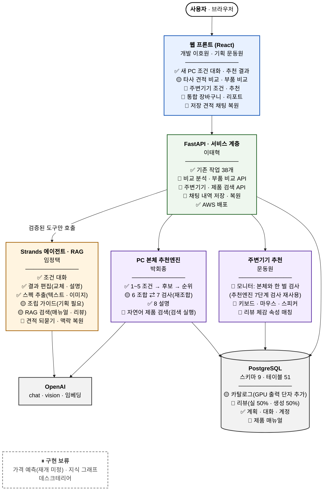

# TrueFit 기획서 — 9월 30일 개발 기준

| 항목 | 내용 |
|---|---|
| 기준 | 2026-09-21(월) 팀 공유 내용 |
| 작성 | 2026-09-24 (수정 2026-09-25, 역할 조정 반영) |
| 목표일 | **2026-09-30** |
| 용도 | 9/30까지 무엇을 어느 방향으로 개발할지 판단하는 기준 문서. 현재 구현 현황과 앞으로 개발할 범위를 함께 적는다 |
| 참고 | 추천엔진 현황 쉬운 설명(2026-09-22), `docs/decisions/0001~0004`, 현재 코드(브랜치 `front`, `develop`) |

**상태 표기**

| 표기 | 뜻 |
|---|---|
| ✅ 구현 | 코드와 화면에서 동작한다 |
| 🟡 부분 | 일부만 되거나, 백엔드·화면 중 한쪽만 있거나, 목업이다 |
| 🎯 9/30 | 9/30까지 개발할 대상 |
| ⏸ 보류 | 이번 범위에서 개발하지 않는다 |
| ❓ 논의 | 결정이 나지 않았다 |

---

## 1. 개요

### 1.1 한 줄 정의

**TrueFit은 사용자와 대화하면서 PC 견적을 짜 주고, 모든 추천에 그 이유를 보여 주는 견적 에이전트다.**
TrueFit은 서로 맞는 부품 한 벌을 코드로 계산해 찾아 준다. 사람이 채팅으로 묻고 고치면서 견적을 완성한다. 구매 결정은 사람이 한다.

### 1.2 서비스 범위

| 시스템 분기 | 사용자가 하는 일 | 현재 | 9/30 |
|---|---|---|---|
| **PC 견적 ① 새 본체 견적** | 부품 8종(CPU·GPU·RAM·메인보드·저장장치·파워·케이스·쿨러)을 처음부터 우리 시스템에서 짠다 | ✅ 약 75% | 🎯 완성도 향상 |
| **PC 견적 ② 타사 견적 비교 분석** | 블로그·다나와·유튜브 등에서 받은 견적을 캡처나 텍스트로 가져와 우리 사이트에서 비교 분석하고 되묻는다. 같은 카테고리 안의 부품끼리 비교한다 | 🟡 인식·매칭까지 | 🎯 비교 분석·되묻기 |
| **PC 주변기기 견적** | 모니터·마우스·키보드·스피커 견적을 짠다 | 🟡 약 5% (데이터만 있음) | 🎯 신규 개발 |

세 분기 모두 다음 공통 요구를 지킨다.

1. **대화로 견적을 짠다.** 견적은 사용자와 대화하면서 만든다.
2. **채팅으로 묻고 고친다.** 추천이 마음에 들지 않거나 궁금한 점이 있으면 채팅창에 적는다. 시스템은 답하고, 필요하면 견적을 수정한다.
3. **모든 추천에 이유가 있다.** 추천한 모든 품목에 이유가 있어야 하고, 그 이유를 화면에 보여 준다.

### 1.3 9/30 목표

> 세 여정(새 본체, 타사 견적 비교, 주변기기)과 이를 잇는 통합 여정이 **대화 → 추천(이유 포함) → 채팅 수정 → 장바구니 → 리포트·조립 가이드**까지 끊기지 않고 이어진다.

9/30까지 우선할 일(제안, 팀 확정 필요)

| 등급 | 항목 | 담당                          |
|---|---|-------------------------------|
| **P0** | 본체 추천: 검사에서 문제가 나오면 다시 조합하는 루프를 실제 서비스 경로에 연결 | 박회종                        |
| **P0** | 타사 견적 비교 분석·같은 카테고리 부품 비교 결과 화면과 되묻기 채팅 | 이태혁 · 임정택 · 이호원      |
| **P0** | GPU 출력 단자 데이터 추가(모니터 한 벌 검사에 필수, 가장 먼저 시작) | 박회종                        |
| **P0** | 모니터 추천(본체와 한 벌로 검사) | 문동원                        |
| **P0** | 여정별 화면 기획, 장바구니·확정·리포트 화면 재기획 | 문동원 (기획) · 이호원 (개발) |
| **P0** | 조립 가이드 기획·개발(5.5절) | 임정택                        |
| **P0** | 리뷰 데이터 적재(제품당 0~100건, 실데이터 50%·생성 50%). 해커톤 제출 때 생성 리뷰를 뺄 수 있는 구조로 | 박회종                        |
| **P0** | 주변기기 리뷰 수집·생성(제품별 0~100건) | 팀원 개별 과제(이번 주) |
| **P0** | 견적 저장 시 채팅 내역 저장, 다시 열면 이전 맥락으로 답변 | 임정택 · 이태혁 |
| **P0** | AWS 배포 유지: 기능이 `develop`에 머지될 때마다 재배포·확인, 해커톤 제출 설정(생성 리뷰 제외) 확인 | 이태혁 |
| P1 | 키보드·마우스·스피커 추천(스펙 + 리뷰 체감 근거) | 문동원                        |
| P1 | 자연어 제품 검색 | 박회종                        |
| P1 | RAG 검색 고도화(매뉴얼·구매 전 확인·후기 문장) | 임정택                        |
| P1 | 후기 문장을 사용자 조건 주제에 맞춰 정렬 | 박회종                        |
| P2 | 게임 요구 사양에 출처 붙이기, 검사 결과에 제조사 문서 근거 붙이기, 이상 가격 4건 원본 대조 | 박회종                        |

### 1.4 팀 역할

| 이름 | 역할 |
|---|---|
| **문동원** | 화면 기획(전 여정) · PC 주변기기 추천 파이프라인 개발 |
| **박회종** | PC 본체 추천엔진 개발. 검색 기능 포함: 자연어 제품 검색(검색 실행), 추천엔진 3단계 후보 수집. 리뷰 데이터 적재. GPU 출력 단자 데이터 추가 |
| **임정택** | LLM 고도화(채팅). **RAG 전체**(검색과 문장 생성). **조립 가이드 기획·개발**. 리뷰 클렌징·가격 예측은 진행 여부 미정(❓) |
| **이태혁** | 백엔드 · 내 PC 견적 점검(타사 견적 비교·부품 비교) 파이프라인 개발. 이 파트의 화면 기획에도 참여. **AWS 배포** |
| **이호원** | 프론트엔드 |

**임정택·박회종의 경계.** 정택은 사람 말과 구조 사이의 번역을 맡는다: 자연어를 검색 조건으로 바꾸고, 어떤 도구를 부를지 정하고, 찾아온 결과로 답변을 쓴다. 회종은 구조화된 조건으로 무엇을 찾아오고 판정할지를 맡는다: 카탈로그 검색, 후보 수집, 순위, 호환 판정. 두 사람은 **검색 도구의 입출력 형식**(입력: 카테고리·필터·키워드·개수 / 출력: 제품 id·이름·걸린 이유)을 먼저 합의한다. RAG는 검색과 문장 생성 모두 정택이 맡는다.

### 1.5 구현 보류

| 항목 | 상태 | 비고 |
|---|---|---|
| 데스크테리어 | ⏸ | 화면에 책상 크기 입력 모달(`DeskModal`)이 남아 있다. 이번 범위에서 확장하지 않는다 |
| 가격 예측 | ⏸ 재개 여부 미정 | 담당 임정택. 가격 추적 워커(`price_poll_worker`)는 스텁이다. 주변기기 가격도 출처·시점이 없어 예측 근거로 쓸 수 없다 |
| 지식 그래프 | ⏸ | 관련 코드 없음 |

---

## 2. 문제 정의·기획 배경

### 2.1 목적 구매는 반복되는 조사 노동이다

PC를 사려는 사람은 매번 부품 8종의 규격, 가격, 리뷰를 직접 찾아 비교한다. 주변기기까지 더하면 품목이 12종으로 늘어난다. 검색, 비교, 호환 확인을 사람이 전부 한다.

### 2.2 PC 견적은 "좋은 부품 고르기"가 아니라 "서로 맞는 한 벌 찾기"다

부품 하나하나가 좋아도 서로 안 맞으면 쓸 수 없다. 규격이 다른 CPU와 메인보드는 꽂히지 않는다. 케이스보다 긴 그래픽카드는 들어가지 않는다. 용량이 모자란 파워로는 PC가 켜지지 않는다. 여기서 세 가지 요구가 나온다.

| 요구 | 이유 |
|---|---|
| **순위와 호환 검사를 분리한다** | "덜 좋은 부품 추천"은 아쉬운 정도지만 "안 맞는 부품 추천"은 사용자가 돈을 버리는 일이다. 틀렸을 때의 손해가 한쪽으로 치우친다 |
| **근거를 댈 수 있어야 한다** | 수십만 원을 쓰기 전에 사람은 "왜 이걸 골랐냐"고 묻는다. 설명은 지어낸 말이 아니라 실제로 계산한 내용이어야 한다 |
| **"아직 모름"이라고 답할 수 있어야 한다** | 부품 자료는 늘 불완전하다. 자료가 없을 때 "안 맞음"으로 단정하면 멀쩡한 부품이 사라지고, "괜찮음"으로 넘기면 안 맞는 부품이 들어간다 |

### 2.3 이유 없는 추천과 믿기 어려운 리뷰

사람들이 많이 기대는 두 정보원이 가장 믿기 어렵다. 추천 사이트는 숫자만 주고 이유를 말하지 않는다. 리뷰 점수는 조작될 수 있다.

### 2.4 타사 견적을 받아도 검증할 곳이 없다

블로그, 다나와, 유튜브에서 견적을 받아도 사용자는 그 견적이 서로 맞는지, 가격이 적정한지, 자기 용도에 맞는지 확인할 방법이 없다. 견적은 캡처 이미지나 설명란 텍스트로 떠돈다.

### 2.5 본체와 주변기기가 따로 논다

본체 성능 목표는 모니터 해상도·주사율과 함께 정해져야 한다. 그래픽카드 출력 단자와 모니터 입력 단자도 맞아야 한다. 현재 시스템은 **"어떤 화면으로 쓸 건가요"를 물어서 본체 성능 목표를 정하면서도 정작 모니터는 추천하지 않는다.** 주변기기를 넣어야 할 이유가 이미 설계 안에 들어 있다.

### 2.6 기획 방향

위 문제를 **대화형 견적 에이전트**로 푼다. 판단(호환, 순위, 예산 계산)은 코드가 하고, 언어 모델은 사람의 말을 조건으로 바꾸고 계산 결과를 사람 말로 옮긴다. 사용자는 채팅으로 언제든 묻고 고칠 수 있고, 모든 추천에서 이유를 볼 수 있다.

---

## 3. 설계 원칙

기존 원칙에 9/30 신규 기능을 만들 때 지킬 기준을 더했다. 기존 원칙은 코드로 강제되어 있어서, 어기려고 하면 실제로 막힌다.

| # | 원칙 | 뜻 | 9/30 신규 기능에 적용 |
|---|---|---|---|
| P1 | **판단은 계산이, 설명만 AI가** | 호환 판정·순위·예산·저장되는 모든 값은 코드가 계산한다. AI는 자유 문장을 조건으로 바꾸고, 계산 결과를 문장으로 옮긴다 | 주변기기 추천, 타사 견적 비교 분석도 판정은 코드가 한다. 이미지에서 부품을 읽는 것은 AI가 하지만, 어떤 제품인지 매칭하고 호환을 판정하는 것은 코드가 한다 |
| P2 | **모든 추천에는 이유가 있다** | 추천 품목마다 이유, 구매 전 확인, 리뷰 관측을 붙인다. 순위에서 밀려난 부품도 왜 밀렸는지 보여 준다 | 주변기기, 타사 견적 대안 제안, 채팅 수정 결과에도 이유를 붙인다 |
| P3 | **모르는 건 모른다고** | 자료가 없으면 "안 맞음"도 "괜찮음"도 아닌 "확인하지 못함"으로 안내한다. 자료가 빠진 부품은 점수를 조금 깎아, 자료가 부실한 부품이 검사를 피해 계속 뽑히는 일을 막는다 | 타사 견적에서 카탈로그에 없는 부품은 "대응 제품 없음"으로 표시하고 추측으로 채우지 않는다 |
| P4 | **왜 모르는지까지 말한다** | "후기가 적어서"와 "자료 파일을 못 받아서"를 구분해 안내한다 | 이미지 인식이 꺼져 있거나 실패하면 빈 결과로 넘기지 않고 오류로 알린다(이미 구현) |
| P5 | **AI가 고장 나도 돌아간다** | 모든 AI 기능에 대신할 정해진 문장이나 규칙 경로가 있다. 모델을 꺼도 숫자는 하나도 바뀌지 않는다 | 신규 채팅 도구, 조립 가이드, 주변기기 설명에도 규칙 기반 폴백을 둔다 |
| P6 | **상태를 바꾸는 길은 검증된 도구뿐** | 에이전트는 DB를 직접 만지지 않는다. 채팅으로 하는 교체·수정은 화면 버튼과 같은 서비스 코드 경로를 지난다. 서비스가 모르는 제품 id는 거부된다 | 채팅으로 주변기기를 교체하거나 타사 견적 부품을 대안으로 바꿀 때도 같은 경로를 쓴다 |
| P7 | **근거 없는 판정은 하지 않는다** | 리뷰 조작 여부를 판정하지 않고 관찰한 사실만 전한다. 관측은 순위를 조금 낮출 뿐 후보를 탈락시키지 않는다. 건수·오차 범위·비교 기준을 항상 함께 낸다 | 리뷰 수가 적어 생성 리뷰로 리뷰 수를 늘린다. 리뷰 관측·통계는 실데이터와 생성 리뷰를 함께 써서 계산한다(5.6절) |
| P8 | **대충 한 건 대충 했다고** | 조합을 다 따져 보지 못하고 상위 일부만 봤으면 최선이라고 말하지 않는다 | 주변기기 조합도 같은 기준 |
| P9 | **에이전트는 제안하고 사람이 결정한다** | 모든 추천은 편집할 수 있다. 아무것도 대신 사지 않고, 링크는 판매처로 간다 | 모든 여정 공통 |
| P10 | **서버에 없는 값은 화면에 내지 않는다** | 서버가 모르는 값을 0, "—", 역산 값으로 채우지 않고 그 자리를 비운다(결정 0003, 0004) | 신규 화면 기획 공통 |

---

## 4. 사용자 여정

각 여정은 단계마다 **화면 / 사용자 / 시스템 / 채팅 / 이유 노출**을 정리했다. 모든 여정에서 채팅창은 항상 열려 있다.

### 4.1 PC 견적

#### 4.1.1 새 본체를 처음부터 견적 짜기

| 단계 | 화면 | 사용자 | 시스템 | 채팅 | 이유 노출 | 상태 |
|---|---|---|---|---|---|---|
| 1. 진입 | 메인 | "새 PC 견적" 선택 | 조건 세션 생성(`category=computer`, `mode=build`) | — | — | ✅ |
| 2. 조건 대화 | 조건 대화 | 필수 항목은 칩으로, 나머지는 자유 문장으로 답한다("150만 원, 조용한 게임용, 엘든링, 흰색 케이스") | 조건 에이전트가 문장을 검증된 조건으로 바꾸고, 빠진 필수 항목을 이어서 묻는다. 필수 항목이 다 차면 추천할 수 있다 | 조건 대화 자체가 채팅 | 어떤 조건이 들어갔는지 칩으로 보여 준다 | ✅ |
| 3. 추천 | 추천 결과 | 기다린다 | 추천엔진 1~8단계 실행(5.2절). 검사에서 문제가 나오면 다시 조합한다(🎯) | — | 품목마다 이유, 구매 전 확인, 리뷰 관측, 호환 검사 결과, 밀려난 후보와 그 이유 | ✅ / 🎯 재조합 |
| 4. 묻고 고치기 | 추천 결과 + 채팅 | "CPU 더 싼 걸로 바꾸고 GPU는 왜 골랐는지 알려줘" | 결과 에이전트가 대안 조회, 교체, 수량·시점 변경, 설명을 한다. 교체 뒤에는 다시 검사한다(🎯) | ✅ 결과 에이전트 | 교체한 이유, 저장된 근거로만 한 설명 | ✅ / 🎯 재검사 |
| 5. 장바구니 확정 | 장바구니 | 이름, 구매 예정일, 목표 금액, 메모를 입력하고 확정한다 | 확정 스냅샷 저장(로그인 필요). 견적을 저장하면 그 견적의 채팅 내역도 모두 함께 저장한다(CHAT-08) | — | 품목별 이유 요약 유지 | ✅ / 🎯 재기획 |
| 6. 리포트 | 리포트 | 리포트 확인, 인쇄·PDF 저장 | 확정 스냅샷, 판매처 링크, 목표가 추적, 조립 가이드 | — | 품목별 이유 | 🟡 조립 가이드는 기획 필요(5.5절) |
| 7. 다시 돌아오기 | 저장한 견적 목록 → 추천 결과 + 채팅 | 저장한 견적을 다시 열고 이어서 묻는다 | 이전 채팅 내역을 화면에 복원하고, 에이전트가 이전 맥락을 기억해 답한다 | 🎯 | 이전 대화에서 바꾼 내용과 그 이유 | 🎯 |

#### 4.1.2 타사 사이트 견적을 가져와 되묻기·비교

> 이 파트는 **이태혁**이 개발한다. 아래 흐름은 현재 기준안이며 이태혁의 개발 방향에 따라 바뀔 수 있다. 견적 되묻기에 더해 **같은 카테고리 안의 부품 비교** 기능이 추가될 예정이다. 이 파트의 화면 기획은 문동원·이호원에 **이태혁의 의견을 반영해** 함께 한다.

| 단계 | 화면 | 사용자 | 시스템 | 채팅 | 이유 노출 | 상태 |
|---|---|---|---|---|---|---|
| 1. 진입 | 메인 | "받은 견적 점검" 선택 | — | — | — | 🟡 |
| 2. 견적 올리기 | 견적 업로드 | 다나와·블로그·유튜브 견적을 **이미지 캡처**로 올리거나, **텍스트·파일**로 붙여 넣는다 | 스펙 추출 에이전트가 이미지·텍스트에서 부품을 슬롯별로 읽는다. 텍스트는 AI가 실패하면 규칙 파서로 처리한다. 이미지는 대안이 없으므로 실패하면 오류로 알린다 | — | — | ✅ |
| 3. 인식 결과 확인 | 견적 구성 표 | 읽어 낸 부품 목록을 확인하고 틀린 부분을 고친다 | 카탈로그 매칭: 대응 제품을 찾으면 그 스펙을 쓰고, 모호하면 후보들이 공통으로 가진 값만 쓴다. 근거가 없으면 비워 둔다 | 채팅으로도 수정할 수 있다(🎯) | 각 부품이 카탈로그의 어떤 제품으로 대응됐는지, 또는 "대응 제품 없음" | ✅ 매칭 / 🎯 채팅 |
| 4. 비교 분석 | 비교 분석 결과 | 결과를 본다 | **호환 검사**(추천엔진 7단계와 같은 규칙), **가격 비교**(견적 가격과 우리 카탈로그 가격), **용도 대비 균형**(사용자 조건 대비 부족·과잉 부품), **우리 추천안과의 차이** | — | 판정마다 계산 근거. 모르는 항목은 "확인하지 못함" | 🎯 |
| 5. 부품 비교 | 부품 비교 | 견적 속 부품 하나를 골라 같은 카테고리의 다른 부품과 비교한다(예: 견적의 GPU와 다른 GPU들) | 같은 카테고리 부품의 스펙·가격·리뷰를 나란히 보여 주고, 견적의 다른 부품과 호환되는지 함께 표시한다 | 채팅으로 비교 대상을 바꿀 수 있다 | 비교 항목별 수치와 출처 | 🎯 (세부는 이태혁 개발 방향에 따름) |
| 6. 되묻기 | 비교 분석 + 채팅 | "이 파워로 충분해?", "GPU만 바꾸면 얼마 더 들어?" | 채팅 에이전트가 저장된 비교 결과를 근거로 답하고, 대안을 조회한다 | 🎯 현재 점검 화면 대화는 목업 | 답변마다 근거가 된 검사·가격 수치 | 🟡 목업 |
| 7. 대안 적용 | 비교 분석 → 장바구니 | 제안된 대안 부품을 받아들인다 | 대안을 반영한 견적을 새 계획으로 만든다. 현재는 업그레이드 추천(`mode=upgrade`)을 재사용한다 | ✅ | 대안을 고른 이유 | 🟡 |
| 8. 확정·리포트 | 4.1.1의 5~7단계와 같다 | | | | | |

현재 점검 화면(`/check`, `/check/review`)은 **내가 가진 PC의 업그레이드 점검**용으로 만들어져 있다. 타사 견적 비교 분석·부품 비교 여정에 맞게 화면을 재기획한다(5.7절).

### 4.2 PC 주변기기 견적

| 단계 | 화면 | 사용자 | 시스템 | 채팅 | 이유 노출 | 상태 |
|---|---|---|---|---|---|---|
| 1. 진입 | 메인 | "주변기기 견적" 선택. 필요한 품목(모니터·마우스·키보드·스피커)을 고른다 | 주변기기 세션 생성 | — | — | 🎯 |
| 2. 조건 대화 | 주변기기 조건 대화 | 용도, 예산, 스펙 선호와 함께 **원하는 느낌**을 말한다("조용하고 쫀득한 타건감", "손이 작아서 가벼운 마우스", "오래 봐도 눈이 편한 모니터") | 조건 에이전트가 스펙 조건과 체감 조건으로 나눠 바꾼다. 카테고리 설정만 추가하면 같은 에이전트를 재사용한다(5.4절) | 조건 대화 자체가 채팅 | 들어간 조건을 칩으로 | 🎯 |
| 3. 추천 | 주변기기 추천 결과 | 기다린다 | 품목별로 후보 수집 → 스펙 하드필터 → **스펙 적합도와 리뷰 체감 적합도**로 순위 → 선택 | — | 품목마다 이유: 스펙 근거와 **리뷰 근거**("리뷰 N건 중 M건이 '조용하다'고 언급" + 대표 문장) | 🎯 |
| 4. 묻고 고치기 | 결과 + 채팅 | "마우스 무선으로 바꿔줘", "이 모니터 왜 골랐어?" | 결과 에이전트 도구로 교체·설명 | 🎯 | 교체 이유 | 🎯 |
| 5. 장바구니·리포트 | 통합 장바구니·리포트 | 확정 | 확정 스냅샷, 리포트. 주변기기는 설치가 간단하므로 조립 가이드를 만들지 않는다(5.5절) | — | 품목별 이유 | 🎯 |

품목별 스펙 조건은 이미 적재된 데이터 컬럼을 기준으로 정한다. 체감 조건은 리뷰에서 뽑는다(5.4절 PER-09).

| 품목 | 데이터 수 | 조건·필터에 쓸 스펙(데이터에 있는 것) |
|---|---|---|
| 모니터 | 33 | 화면 크기, 해상도, 최대 주사율, 패널, 응답 속도, 밝기, 곡률, HDMI·DP 버전과 개수, USB-C 영상 입력, VESA |
| 키보드 | 41 | 연결 방식, 인터페이스, 축 종류, 스위치 방식, 래피드 트리거 |
| 마우스 | 84 | 연결 방식, 폼팩터, 센서, DPI, 폴링레이트, 버튼 수, 무게 |
| 스피커 | 45 | 연결 방식, 형태, 채널, 출력, 전원 방식 |

### 4.3 PC 견적 뒤 주변기기까지 묻는 통합 여정

4.1과 4.2를 잇는 여정이다. **본체 조건을 주변기기로 이어받는 것**이 핵심이다.

| 단계 | 사용자 | 시스템 | 상태 |
|---|---|---|---|
| 1. 본체 견적 완료 | 4.1.1 또는 4.1.2를 마친다 | 추천 결과 화면에서 "주변기기도 맞출까요?"를 제안한다 | 🎯 |
| 2. 조건 이어받기 | 필요한 품목만 고른다. 이미 답한 것은 다시 묻지 않는다 | 본체 조건 중 **용도, 목표 해상도·주사율, 남은 예산, 확정된 GPU의 출력 단자**를 주변기기 조건으로 넘긴다 | 🎯 |
| 3. 모니터: 본체와 한 벌로 검사 | — | 모니터는 본체와 한 벌로 본다. **GPU 출력 단자와 모니터 입력 단자**가 맞는지, **모니터 해상도·주사율이 본체 성능 목표와 맞는지** 검사한다 | 🎯 (GPU 출력 단자 데이터 필요) |
| 4. 키보드·마우스·스피커: 개별 선택 | — | 서로 관계가 없으므로 조건에 맞는 것을 품목마다 하나씩 고른다 | 🎯 |
| 5. 통합 장바구니 | 본체와 주변기기를 한 장바구니에서 보고 고친다 | 본체와 주변기기 합계, 예산 대비 잔액을 보여 준다 | 🎯 |
| 6. 통합 리포트 | 확정 | 본체와 주변기기를 한 리포트로. 조립 가이드는 본체 부품을 산 경우에만 붙는다(5.5절) | 🎯 |

❓ **예산 배분.** 사용자가 총예산 하나를 말했을 때 본체와 주변기기에 어떻게 나눌지 정해야 한다. 방안은 두 가지다.

- 본체를 먼저 확정하고 남은 금액을 주변기기 예산으로 쓴다.
- 처음부터 총예산을 나눠 제안한다.

---

## 5. 기능 명세서

기능 ID 규칙은 `영역-번호`다. 담당은 1.4절 기준이다.

### 5.1 대화·채팅·RAG — 임정택

| ID | 기능 | 설명 | 상태 |
|---|---|---|---|
| CHAT-01 | 조건 대화 에이전트 | 자유 문장을 카테고리 스키마로 검증된 조건으로 바꾼다. 틀린 값은 오류 문자열로 돌아가 모델이 고친다. 무엇이 필수인지는 서비스가 매번 다시 계산한다 | ✅ |
| CHAT-02 | 결과 편집 에이전트 | 대안 조회, 교체, 수량, 시점, 제외·복구, 설명 도구 6개. 모든 도구가 기존 서비스 호출을 감싼다 | ✅ |
| CHAT-03 | 스펙 추출 에이전트 | 타사 견적 텍스트와 이미지(PNG·JPEG·WebP, 5MB 이하)에서 부품을 슬롯별로 추출한다 | ✅ |
| CHAT-04 | 타사 견적 되묻기 채팅 | 비교 분석 결과를 근거로 답하고 대안을 조회한다. 현재 점검 화면 대화(`reviewReply`)는 목업이고 백엔드 API가 없다 | 🎯 |
| CHAT-05 | 주변기기 대화 | CHAT-01·02를 주변기기 카테고리에 재사용한다. 주변기기 교체·설명 도구를 추가한다 | 🎯 |
| CHAT-06 | 자연어 제품 검색 도구 | 채팅에서 "흰색 RTX 4070 있어?"처럼 물으면 문장을 검색 조건으로 바꿔 SEARCH-01(박회종)을 호출하고, 결과로 답한다 | 🎯 |
| CHAT-07 | 대화 품질 고도화 | 여정 간 맥락 유지(본체에서 주변기기로), 모르는 질문에 대한 정직한 답, 폴백 문장 품질 | 🎯 |
| CHAT-08 | 대화 이력 저장·맥락 복원 | 로그인한 사용자가 견적을 저장하면 **그 견적의 채팅 내역을 모두 저장**한다. 저장한 견적을 다시 열면 채팅 내역을 화면에 복원하고, 에이전트는 이전 맥락을 기억해 답한다. 현재 조건 대화 메시지는 이미 DB(`identity.message`)에 저장되지만, 결과 화면 채팅 내역은 서버 메모리에만 있어 재시작하면 사라지고 화면 복원 API도 없다. 긴 대화는 최근 몇 턴 원문과 그 이전 요약을 에이전트에 넘긴다. 에이전트는 대화 기록이 아니라 저장된 계획 상태를 사실의 기준으로 삼는다(이전 대화와 현재 견적이 다르면 현재 견적이 우선) | 🎯 P0 |
| RAG-01 | RAG 검색·문장 생성 | 매뉴얼·구매 전 확인 문서·후기 문장에서 근거를 찾고, 찾은 근거로만 문장을 쓴다. 조립 가이드(5.5절), 구매 전 확인, 검사 근거(ENG-06)가 공통으로 쓴다. 현재는 합성 문서 18건, 기동 시 인메모리 임베딩 | 🟡 |

### 5.2 PC 본체 추천엔진 — 박회종

추천엔진 9단계와 현재 코드의 대응:

| 단계 | 하는 일 | 코드 | 상태 |
|---|---|---|---|
| 1 | 뭘 원하는지 듣기 | `stage1_intent`, 조건 에이전트 | ✅ |
| 2 | 기준으로 바꾸기(등급, 전원 와트 등) | `stage2_requirement`. 설정에 실수가 있으면 시작할 때 멈춘다 | ✅ 가장 튼튼함 |
| 3 | 살 수 있는 물건 모으기 | `stage3_0_candidates`. DB 카탈로그를 읽고, 없으면 합성 카탈로그로 강등한다 | ✅ |
| 4 | 명백히 안 되는 것 빼기 | `stage3a_hardfilter` | ✅ |
| 5 | 줄 세우기(가격·성능·균형·후기·여유) | `stage3b_rank`. 검사 자료가 빠진 부품은 소폭 감점한다 | ✅ (후기 20%는 자료 파일 필요) |
| 6 | 한 벌로 조합하기 | `stage4_optimize` | ✅ |
| 7 | 완성된 한 벌 다시 검사 | `stage3c_verify`. 소켓·전력·GPU 길이·쿨러 높이·메인보드 호환을 실제로 비교한다 | ✅ |
| 6⇄7 | 문제가 나오면 문제 부품을 빼고 다시 조합(최대 3회) | 시연 경로(`pipeline.py`)에만 있고 실제 서비스 경로(`recommendation_service`)에는 없다 | 🎯 **P0** |
| 8 | 왜 골랐는지 설명 | `stage5_explain`. 숫자는 계산, 문장만 AI가 쓴다. 밀려난 후보도 보여 준다 | ✅ |
| 9 | 나중에 배우기 | `stage6_feedback` 스텁 | ⏸ 이번 범위 밖 |

| ID | 기능 | 설명 | 상태 |
|---|---|---|---|
| ENG-01 | 재조합 루프 | 7단계 검사에서 문제가 나오면 문제 부품을 빼고 6단계로 돌아간다. 시연 경로의 흐름을 서비스 경로가 함께 쓰게 한다 | 🎯 P0 |
| ENG-02 | 교체 후 재검사 | 채팅·버튼으로 부품을 바꾸면 7단계 검사를 다시 돌리고 결과를 알린다 | 🎯 |
| ENG-03 | 리뷰 관측 반영 | 리뷰 분석 파일이 없으면 후기 점수가 모든 부품에서 "모름"이 된다. 5.6절의 적재와 연결한다 | 🎯 |
| ENG-04 | 후기 문장 주제 정렬 | 사용자 조건에 맞는 주제(예: "조용한" → 소음·발열)의 후기 문장을 위로 올린다. 자료와 주제 표시가 이미 있다. 후기 문장을 점수로 바꾸지 않는다 | 🎯 P1 |
| ENG-05 | 게임 요구 사양 출처 | 게임 15개의 요구 등급(잠정값)에 배급사 공식 출처와 확인 날짜를 붙인다. 사람이 승인한 뒤 반영한다 | P2 |
| ENG-06 | 검사 결과 근거 | 7단계 검사 결과에 제조사 문서 근거를 붙인다(RAG-01 활용, 임정택 협업) | P2 |
| ENG-07 | 이상 가격 대조 | 같은 등급 평균의 3.1배인 GPU 등 4건을 원본과 대조한다 | P2 |
| ENG-08 | **GPU 출력 단자 데이터 추가** | `catalog.gpu_spec`에 출력 단자 정보가 없다. 모니터 데이터와 같은 기준(HDMI 버전·개수, DP 버전·개수, USB-C 영상 출력)으로 **GPU 출력 단자 데이터를 추가한다.** 모니터를 본체와 한 벌로 검사하는 데(PER-04) 필수이고 수집에 시간이 걸리므로 가장 먼저 시작한다 | 🎯 **P0 데이터 추가** |

**검색 기능**(추천엔진 영역, 박회종)

| ID | 기능 | 설명 | 상태 |
|---|---|---|---|
| SEARCH-01 | 자연어 제품 검색(검색 실행) | 검색 조건(카테고리·필터·키워드)을 받아 카탈로그에서 제품을 찾고, 결과에 매칭 근거를 붙인다. 자연어를 검색 조건으로 바꾸는 일은 채팅(CHAT-06, 임정택)이 한다. 화면 검색창에서도 쓴다 | 🎯 P1 |
| SEARCH-02 | 후보 수집 | 추천엔진 3단계. 본체 8종에 주변기기 4종을 더해 같은 인터페이스로 후보를 모은다 | ✅ 본체 / 🎯 주변기기 |

### 5.3 내 PC 견적 점검(타사 견적 비교·부품 비교) — 이태혁

아래 명세는 현재 기준안이다. 이태혁의 개발 방향에 따라 바뀔 수 있다.

| ID | 기능 | 설명 | 상태 |
|---|---|---|---|
| CHK-01 | 견적 입력 | 이미지 캡처, 텍스트, 파일. 텍스트는 2만 자, 이미지는 5MB까지 | ✅ |
| CHK-02 | 부품 추출 | CHAT-03 호출. 텍스트는 규칙 파서로 폴백하고, 이미지는 실패하면 503으로 알린다 | ✅ |
| CHK-03 | 카탈로그 매칭 | 추천 계산과 같은 카탈로그·같은 매칭 함수를 쓴다(`POST /pc/owned-parts/preview`). 아무것도 저장하지 않는다 | ✅ |
| CHK-04 | 호환 검사 | 매칭된 견적에 추천엔진 7단계 검사를 그대로 적용한다 | 🎯 |
| CHK-05 | 가격 비교 | 견적에 적힌 가격과 카탈로그 가격을 부품별로 비교한다. 견적에 가격이 없으면 비교하지 않는다(P10) | 🎯 |
| CHK-06 | 용도 대비 균형 | 사용자 조건(용도·해상도·예산) 대비 부족하거나 과한 부품을 짚는다. 추천엔진 2단계 기준을 재사용한다 | 🎯 |
| CHK-07 | 우리 추천과 비교 | 같은 조건으로 추천엔진을 돌려 타사 견적과 품목별로 나란히 보여 준다 | 🎯 |
| CHK-08 | 대안 적용 | 비교 결과의 대안을 받아 새 계획으로 만든다. 업그레이드 추천(`mode=upgrade`)을 재사용한다 | 🟡 |
| CHK-09 | 비교 분석 결과 저장 | 되묻기 채팅(CHAT-04)이 근거로 쓸 수 있도록 세션에 저장한다 | 🎯 |
| CHK-10 | 같은 카테고리 부품 비교 | 견적 속 부품을 같은 카테고리의 다른 부품과 스펙·가격·리뷰로 나란히 비교하고, 견적의 나머지 부품과 호환되는지 함께 보여 준다 | 🎯 |

### 5.4 PC 주변기기 추천 파이프라인 — 문동원

모니터·마우스·키보드·스피커는 본체 부품보다 **사용자 리뷰를 훨씬 많이 보고 고르는 품목**이다. 스펙이 같아도 타건감, 그립감, 소음, 눈의 피로, 음색은 써 본 사람만 말할 수 있다. 그래서 주변기기는 **사용자가 원하는 느낌의 제품을 잘 찾아 주는 것**이 핵심이다. 추천 근거를 스펙뿐 아니라 사용자 리뷰에서도 얻는다. 이를 위해 지금 주변기기 리뷰를 수집하고 있다(PER-08).

본체와의 차이: 본체는 리뷰를 순위의 보조 신호로만 쓴다. 주변기기는 **리뷰 내용(체감)이 순위의 주요 근거**다. 리뷰에서 체감 속성을 뽑는 일은 AI가 하고, 언급 빈도를 집계해 순위에 반영하는 일은 코드가 한다(P1).

| ID | 기능 | 설명 | 상태 |
|---|---|---|---|
| PER-01 | 주변기기 데이터 적재 | 모니터 33, 키보드 41, 마우스 84, 스피커 45. 출처·시점을 모르는 가격은 "지금 살 수 있는 가격"으로 쓰지 않도록 따로 보관한다(`catalog.peripheral_price_snapshot`) | ✅ |
| PER-02 | GPU 출력 단자 데이터 연동 | GPU 출력 단자 데이터는 박회종이 추가한다(ENG-08). 문동원은 모니터 검사에 필요한 항목을 박회종에게 전달하고, 추가된 데이터를 모니터 검사에 쓴다 | 🎯 |
| PER-03 | 주변기기 카테고리 설정 | `config/categories/`에 주변기기 조건 스키마(필드, 필수 여부, 질문)를 추가한다. 조건 에이전트는 카테고리 설정을 읽으므로 코드 변경 없이 재사용된다 | 🎯 |
| PER-04 | 모니터 추천 | 해상도·주사율·크기·패널 조건으로 고르고, 본체와 한 벌로 검사한다(GPU 출력 단자와 입력 단자, 본체 성능 목표와 해상도·주사율) | 🎯 P0 |
| PER-05 | 키보드·마우스·스피커 추천 | 서로 관계가 없으므로 품목마다 조건에 맞는 것을 하나씩 고른다 | 🎯 P1 |
| PER-06 | 추천 이유 | 품목마다 이유와 주요 스펙. 본체와 한 벌인 모니터는 호환 검사 결과까지 보여 준다 | 🎯 |
| PER-07 | 본체 조건 이어받기 | 통합 여정(4.3절)에서 본체 조건과 확정 GPU를 입력으로 받는다 | 🎯 |
| PER-08 | 주변기기 리뷰 수집·생성 | 주변기기 제품별로 리뷰를 **0~100건** 만든다. **이번 주 팀원 개별 과제**다. 적재 규칙은 5.6절을 따른다 | 🎯 P0 진행 중 |
| PER-09 | 리뷰 체감 속성 추출 | 품목별 체감 속성 목록을 정하고(예: 키보드 타건감·소음·키캡 질감, 마우스 그립감·무게감·클릭감, 모니터 눈 편함·색감·빛샘, 스피커 저음·음색·최대 음량), 리뷰마다 어떤 속성을 긍정·부정으로 언급했는지 뽑아 저장한다. 추출은 AI, 집계는 코드가 한다 | 🎯 |
| PER-10 | 느낌 조건 매칭 | 사용자의 느낌 표현("조용하고 쫀득한")을 체감 속성으로 바꾸고, 제품별 속성 언급 비율로 순위를 매긴다. 스펙 적합도와 함께 쓴다. 리뷰가 적은 제품은 비율과 함께 건수를 보여 주고 "리뷰가 적어 판단 근거가 약함"으로 안내한다(P3) | 🎯 |
| PER-11 | 리뷰 근거 이유 | 추천 이유에 "리뷰 N건 중 M건이 '조용하다'고 언급"과 대표 리뷰 문장을 붙인다 | 🎯 |

### 5.5 조립 가이드 — 임정택(기획·개발)

**조립 가이드는 상세 기획이 필요하다.** 매뉴얼 내용을 나열하는 데 그치지 않고, 사용자가 실제로 조립을 더 쉽게 할 수 있도록 돕는 안내가 들어가야 한다.

- 적용 범위: 조립 가이드는 **본체 부품을 따로 사는 사용자에게만** 필요하다. 모니터·키보드·마우스·스피커는 설치가 간단하므로 조립 가이드를 만들지 않는다.
- 현황: 백엔드는 리포트를 열 때 조립 가이드를 만든다(`assembly_guide_agent`, 합성 가이드 18건 검색). 화면(`/plan/report/:id`)은 이 결과를 쓰지 않고 목업 문장을 보여 준다(`web/src/data/assemblyGuide.ts`).

### 5.6 리뷰 데이터 — 박회종

| ID | 기능 | 설명 | 상태 |
|---|---|---|---|
| REV-01 | 리뷰 적재 | 제품별 리뷰를 **0~100건** 내부 DB에 적재한다. 구성은 **국내 실데이터 50%, 생성 데이터 50%**. 실제 리뷰 수가 적어 생성 리뷰로 리뷰 수를 늘린다. 본체 부품과 주변기기(PER-08) 모두 대상 | 🎯 P0 |
| REV-02 | 원천 구분 저장 | 리뷰마다 실데이터와 생성을 구분하는 값을 **내부에** 저장한다(`evidence.review_summary.origin`). 화면에는 "생성" 표기를 하지 않는다 | 🎯 |
| REV-03 | 관측에 생성 리뷰 포함 | 리뷰 관측(7일 몰림, 공유 리뷰어, 한 건뿐인 계정, 구매 확인 비율)과 체감 속성 집계(PER-09)는 **실데이터와 생성 리뷰를 함께** 써서 계산한다. 그러려면 생성 리뷰에도 게시 시각(`review_posted_at`), 작성자 식별값(`author_ref`), 평점을 채워 적재해야 한다 | 🎯 |
| REV-04 | 생성 기준 | 생성 리뷰는 그 제품의 실제 스펙과 실데이터 리뷰 주제 범위 안에서 쓴다. 스펙에 없는 성능 주장은 쓰지 않는다 | 🎯 |
| REV-05 | 추천 반영 | 후기 점수(순위 비중 20%)와 후기 문장(ENG-04)에 반영한다. 관측은 순위를 조금 낮출 뿐 탈락시키지 않는다(P7) | 🎯 |
| REV-06 | 리뷰 클렌징 | 임정택과 논의 후 결정 | ❓ |
| REV-07 | 해커톤 제출용 분리 구조 | 해커톤 심사 제출 때는 생성 리뷰를 뺀다. 한 번에 뺄 수 있게 적재한다: ① 생성 리뷰는 전용 출처(`evidence.source` 한 행)로 묶고 `origin`으로도 구분한다 ② 설정값 하나(예: `REVIEW_INCLUDE_GENERATED=0`)로 조회·추천·화면에서 생성 리뷰를 모두 뺀다 ③ 관측·집계(`evidence.review_aggregate`)는 원천 범위(`source_scope`)별로 따로 만들어 두어, 생성 리뷰를 빼도 재계산 없이 실데이터 수치로 바뀐다 ④ 제출 전에 생성 리뷰를 뺀 상태로 전 여정을 한 번 돌려 확인한다 | 🎯 P0 |

적재 위치: `community.review`는 우리 회원이 쓴 리뷰용이다(`author_user_id` 필수). 외부 실데이터와 생성 리뷰는 `evidence.review_summary`(`source_id`, `origin`, `author_ref`, `review_posted_at` 보유)에 적재한다.

> 리스크: 생성 리뷰를 구분 표기 없이 실제 이용 후기처럼 보여 주는 것은 광고·표시 규제(추천·보증 심사지침 등) 검토 대상이 될 수 있다. 그래서 **해커톤 심사 제출 때는 생성 리뷰를 뺀다**(REV-07). 개발·내부 시연에서만 생성 리뷰를 포함한다.

### 5.7 화면 — 문동원(기획) · 이호원(개발) · 이태혁(견적 점검 화면 기획 참여)

현재 개발된 화면은 **PC 본체 추천 흐름** 중심이다. 여정별(4장) 화면을 추가로 기획·개발해야 한다. 또 **4단계 리스트 확정 화면과 5단계 장바구니 화면이 서로 따로 놀아서** 하나의 흐름으로 새로 기획한다.

| ID | 화면 | 여정 | 현재 경로 | 상태 |
|---|---|---|---|---|
| UI-01 | 메인·여정 선택(새 PC / 받은 견적 점검 / 주변기기) | 공통 | `/` | 🎯 재기획 |
| UI-02 | 로그인·회원가입 | 공통 | `/login`, `/signup` | ✅ |
| UI-03 | 새 PC 조건 대화 | 4.1.1 | `/start` | ✅ |
| UI-04 | 추천 결과 + 채팅 | 4.1.1 | `/plan` | ✅ |
| UI-05 | 견적 업로드·인식 결과 확인 | 4.1.2 | `/check` | 🟡 업그레이드 점검용 → 재기획(이태혁 의견 반영) |
| UI-06 | 비교 분석 결과 + 되묻기 채팅 | 4.1.2 | `/check/review` | 🟡 대화 목업 → 재기획(이태혁 의견 반영) |
| UI-06b | 같은 카테고리 부품 비교 | 4.1.2 | 없음 | 🎯 신규(이태혁 의견 반영) |
| UI-07 | 주변기기 품목 선택·조건 대화 | 4.2 | 없음 | 🎯 신규 |
| UI-08 | 주변기기 추천 결과 + 채팅 | 4.2 | 없음 | 🎯 신규 |
| UI-09 | 본체 → 주변기기 이어가기 | 4.3 | 없음 | 🎯 신규 |
| UI-10 | **통합 장바구니·확정**(본체+주변기기, 품목별 이유 유지) | 공통 | `/plan/confirm` | 🎯 재기획 |
| UI-11 | **리포트**(본체 부품이 있을 때만 조립 가이드) | 공통 | `/plan/report/:id` | 🎯 재기획 |
| UI-12 | 저장한 견적 목록 → 다시 열면 채팅 내역 복원 | 공통 | 사이드 서랍 | ✅ 목록 / 🎯 채팅 복원 |

화면 공통 기준: 채팅창은 모든 추천 화면에 있다. 모든 추천 품목에서 이유를 열어 볼 수 있다. 서버에 없는 값은 비운다(P10).

### 5.8 계정·저장·배포 — 이태혁

| ID | 기능 | 상태 |
|---|---|---|
| ACC-01 | 이메일+비밀번호 가입·로그인, httpOnly JWT, 게스트 → 계정 병합, 탈퇴 | ✅ |
| ACC-02 | 견적 저장·이름 변경·삭제·확정(`If-Match`)·리포트·목표가 알림 | ✅ |
| ACC-03 | 인증 강화(email-availability 속도 제한, 잠금 카운터 초기화, 비밀번호 변경 뒤 JWT 무효화, 탈퇴 시 동의 시각 삭제). 수용 테스트는 이미 작성돼 있다 | 🟡 |
| ACC-04 | 이메일 인증·비밀번호 재설정(`/auth/request-code`, `/auth/verify`는 501) | ⏸ |
| ACC-05 | 공개 전 `/dev` 라우트 차단 | 🎯 |
| DEP-01 | AWS 배포 | 이미 AWS에 배포되어 있다. 기능이 `develop`에 머지될 때마다 다시 배포해 확인한다. 해커톤 제출 전에 제출용 설정(생성 리뷰 제외, REV-07)이 배포 환경에서 동작하는지 확인한다 | ✅ 배포됨 / 🎯 재배포 |

---

## 6. 시스템 아키텍처

기존 그림(`docs/architecture.png`)을 쓰지 않고 현재 코드를 직접 세어 다시 그렸다. 그 위에 9/30 목표를 표시했다.

### 6.1 현재 코드 실측(2026-09-24, 브랜치 `front`·`develop` 참고)

`front`는 `develop`을 받아 온 브랜치다(`develop`의 커밋이 모두 `front`에 들어 있다). 두 브랜치를 함께 참고했다.

| 구성 | 실측 | 비고 |
|---|---|---|
| 프론트 | React + TypeScript + Vite SPA, 라우트 10개 | FastAPI가 같은 오리진에서 `web/dist`를 서빙 |
| API | 라우터 6개, 작업 38개: session 14 · auth 10 · lists 6 · reviews 5 · dev 2 · pc 1 | 오류 형식 하나: `{"error": {"code", "message", "field"}}` |
| 서비스 | session · recommendation · list · auth · review · feedback · notification | notification은 스텁 |
| Strands 에이전트 | **4개**: 조건, 결과, 스펙 추출(텍스트·이미지), 조립 가이드 | README의 "2개"는 낡은 수치 |
| 대화 이력 | 조건 대화는 `identity.message`에 저장, 결과 화면 채팅은 서버 메모리 | 재시작하면 결과 화면 채팅 맥락이 사라진다 |
| 추천엔진 | 1~8단계 동작, 9단계 스텁 | 재조합 루프는 시연 경로에만 있다 |
| RAG | 합성 가이드 18건, 기동 시 인메모리 임베딩 | pgvector 의존성은 제거됨 |
| DB | PostgreSQL 16, **스키마 9 · 테이블 51**, 마이그레이션 4개 | README의 "스키마 10 · 테이블 38"은 낡은 수치 |
| 배포 | AWS(이태혁) | 기능 머지마다 재배포 |
| 외부 | OpenAI: chat, vision(이미지 견적 인식), embeddings | `MOCK_MODE=1`이면 문장만 자리표시로 바뀌고 숫자는 같다 |

### 6.2 전체 구성도

범례: ✅ 구현 · 🟡 부분 · 🎯 9/30 개발 대상 · ⏸ 보류. 박스 색은 담당 영역 구분이다. 서비스 계층은 모든 상태 변경이 지나는 유일한 길이다(6.3절).

### 6.3 계층별 설명

| 계층 | 역할 | 지키는 규칙 |
|---|---|---|
| 프론트 | 여정별 화면과 공통 채팅. 서버가 준 값만 그린다 | 서버에 없는 값은 비운다(P10) |
| API | 단일 오리진. 세션 흐름은 로그인 없이, 확정·리포트는 로그인 필요 | 오류 형식 하나 |
| 서비스 | 모든 상태 변경이 지나는 유일한 길. 소유권 검사와 합계 재계산 | 버튼과 채팅이 같은 코드 경로를 지난다(P6) |
| 에이전트 | 요청마다 현재 계획 상태를 담아 새로 만든다. 도구 호출은 API처럼 검증된다 | AI는 조건 변환·추출·문장만 한다(P1). 실패하면 규칙 경로로 대신한다(P5) |
| 추천엔진 | 서로 맞는 한 벌을 계산한다. 조합과 검사는 서로 다른 규칙을 쓴다 | 모르면 "확인하지 못함"(P3) |
| 주변기기 파이프라인 | 스펙과 리뷰 체감 속성으로 고른다. 모니터는 본체 추천엔진의 7단계 검사와 연결하고, 나머지 3종은 독립적으로 고른다 | 체감 속성 추출은 AI, 집계·순위는 코드 |
| 비교 분석 | 타사 견적을 매칭한 뒤 추천엔진의 검사·기준을 그대로 적용한다. 같은 카테고리 부품 비교를 제공한다 | 추천과 점검이 같은 카탈로그·같은 규칙을 쓴다 |
| 검색 | 제품 검색(카탈로그)·후보 수집은 박회종, RAG 검색(매뉴얼·가이드·후기 문장)은 임정택 | 검색 결과는 근거로만 쓰고 판정에 쓰지 않는다 |
| 데이터 | 카탈로그, 계획·실행 기록, 대화 이력, 근거(리뷰), 매뉴얼, 계정 | 출처·시점을 모르는 가격은 "지금 가격"으로 쓰지 않는다. 생성 리뷰는 설정 하나로 뺄 수 있다 |

### 6.4 주요 데이터 흐름

**A. 새 본체 견적(4.1.1)**

1. 브라우저 → `POST /session` → 조건 세션 생성
2. `POST /session/{id}/message` → 조건 에이전트 → 검증된 조건 패치 → `planning` 저장
3. `POST /session/{id}/recommend` → 즉시 202 → 추천엔진 1~8단계(🎯 6⇄7 재조합) → `engine` 저장
4. `GET /session/{id}/result` 폴링 → 품목·이유·검사·리뷰 관측 표시
5. `POST /session/{id}/result-message` → 결과 편집 에이전트 → 서비스 호출(교체 등) → 바뀐 결과 반환
6. `POST /lists/{id}/confirm` → 스냅샷(🎯 채팅 내역 포함) → `GET /lists/{id}/report` → 조립 가이드 포함
7. 🎯 저장한 견적 다시 열기 → 채팅 내역 복원 → 이전 맥락 + 현재 계획 상태로 에이전트 답변

**B. 타사 견적 비교 분석(4.1.2)**

1. 이미지·텍스트 → `POST /pc/owned-parts/preview` → 스펙 추출 에이전트 → 카탈로그 매칭 표(✅)
2. 🎯 비교 분석 요청 → 매칭된 견적에 7단계 검사 + 가격 비교 + 2단계 기준 대비 균형 + 같은 조건의 추천 결과와 비교 → 세션에 저장
3. 🎯 같은 카테고리 부품 비교 → 스펙·가격·리뷰 비교와 호환 표시
4. 🎯 되묻기 채팅 → 저장된 비교 결과를 근거로 답변과 대안 조회
5. 대안 적용 → 업그레이드 추천 경로(`mode=upgrade`) → 장바구니

**C. 주변기기와 통합(4.2, 4.3)**

1. 🎯 주변기기 세션(주변기기 카테고리 설정) → 조건 에이전트 재사용
2. 통합 여정이면 본체 조건과 확정 GPU(출력 단자)를 입력으로 넘긴다
3. 🎯 모니터: 후보 수집 → 필터 → 순위 → 본체와 한 벌 검사(단자, 해상도·주사율 대 성능 목표)
4. 🎯 키보드·마우스·스피커: 스펙 필터 → 리뷰 체감 속성 적합도로 순위 → 품목별 선택
5. 🎯 통합 장바구니 → 확정 → 통합 리포트(본체 부품이 있을 때만 조립 가이드)

---

## 부록 A. 논의 필요 항목

| # | 항목 | 관련 |
|---|---|---|
| 1 | 리뷰 클렌징을 할지 말지(임정택) | REV-06 |
| 2 | 가격 예측을 재개할지(임정택) | 1.5 |
| 3 | 통합 여정의 예산 배분 방식(본체 확정 후 잔액 vs 처음부터 나눠 제안) | 4.3 |
| 4 | 1.3절 우선순위(P0/P1/P2) 팀 확정 | 1.3 |
| 5 | 타사 견적 비교·부품 비교의 세부 흐름(이태혁 개발 방향에 따름) | 4.1.2, 5.3 |
| 6 | 주변기기 체감 속성 목록 확정(문동원) | PER-09 |
| 7 | 조립 가이드 상세 기획(임정택) | 5.5 |

## 부록 B. 참고 문서

- 추천엔진 현황 쉬운 설명(2026-09-22)
- `docs/decisions/0001` 정제 후 평점을 판정기 없이 내지 않는다
- `docs/decisions/0003` 데모 화면에서 세트 신뢰도·회색축·표시용 리뷰 수를 뺀다
- `docs/decisions/0004` 목업 표시 근거 원칙
- `docs/조건대화_에이전트_strands.md`, `docs/결과화면_에이전트_strands.md`
- `docs/pc_pipeline_overview.md`
