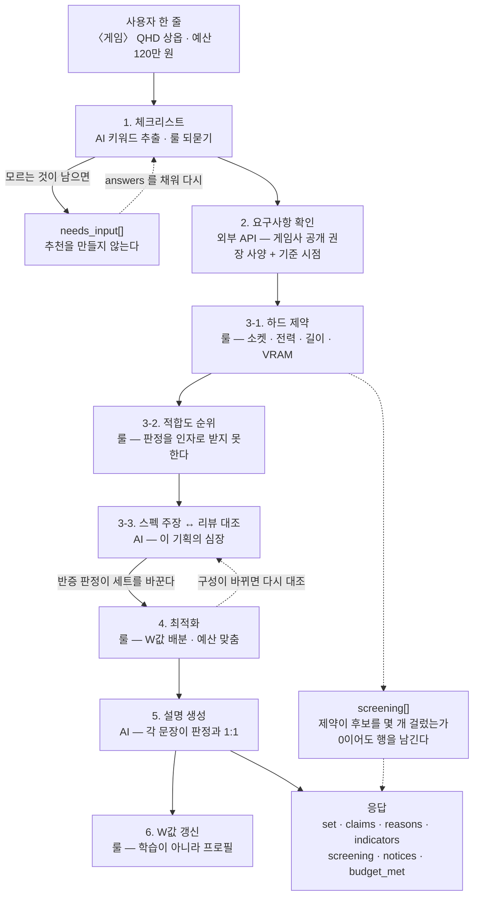
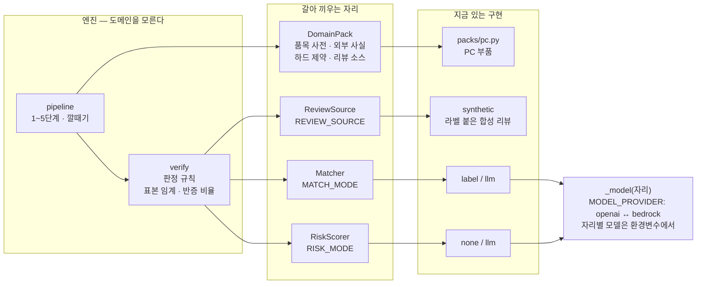
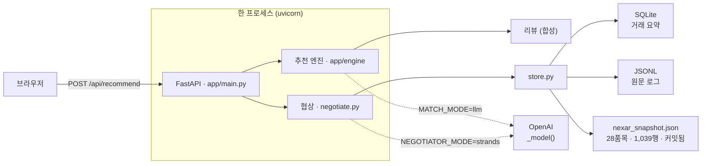

# 아키텍처

> 제출물 요건의 *"Include an Architecture Diagram"* 이 이 문서다.
> **여기 그린 것은 전부 지금 돌아가는 것이다.** 아직 없는 것은 §5에 따로 적었다 —
> 도식에만 있는 구성요소를 그리지 않는 것이 이 문서의 규칙이다.

한 줄: **"이 게임을 이 예산으로 돌리고 싶다" 한 줄이면 부품 세트를 짜 주되,
제조사 스펙이 하는 주장을 리뷰로 대조해 걸러내고 그 판단 근거를 공개한다.**

---

## 1. 추천 엔진 6단계

무엇을 룰이 하고 무엇을 모델이 하는지가 이 그림의 요지다. **전 구간을 AI로 채우지
않는 것 자체가 설계**다 — 값을 정하는 데가 아니라 해석하는 데 쓴다.

**3단계와 4단계가 서로를 부른다.** 목업이 *"검증이 설명용 장식이 아니라 구성에
관여한다는 증거"* 라고 부른 자리다 — CPU 기본 쿨러 주장이 반증되면 쿨러가 세트에
편성되고, 구성이 바뀌었으므로 판정을 다시 낸다. 단방향 파이프라인이 아니다.

---

## 2. 갈아 끼우는 자리

엔진은 도메인을 모른다. **검사가 그것을 강제한다** — 엔진 모듈 어디에도
`packs`·`"pc"`·`vram` 이 없어야 하고, 주석은 `ast` 로 벗겨내고 코드만 본다.

**새 도메인은 `packs/` 파일 하나 + 레지스트리 한 줄이다.** 여행 팩을 넣어도 엔진은
안 바뀐다.

### 전환 축 — 기본값이 전부 키를 안 쓴다

| 환경변수 | 기본값 | 다른 값 |
|---|---|---|
| `RECOMMEND_MODE` | `rule` 1~5단계를 순서대로 | `strands` 에이전트가 순서를 정한다 |
| `MATCH_MODE` | `label` 합성 라벨 | `llm` 모델이 리뷰를 읽는다 |
| `RISK_MODE` | `none` 붙은 점수만 | `llm` 모델이 조작 확률을 매긴다 |
| `REVIEW_SOURCE` | `synthetic` | 새 소스는 `app/reviews/` 에 등록 |
| `MODEL_PROVIDER` | `openai` | `bedrock` (AWS 자격증명은 boto3 표준 체인) |
| `CATALOG_SOURCE` | `snapshot` 실 유통 데이터 | `sqlite` |
| `NEGOTIATOR_MODE` | `rule` | `llm` · `strands` |

**아무것도 설정하지 않아도 전체가 돈다.** 데모 당일 API 가 흔들려도 같은 화면이
나오고, 검사도 키 없이 돈다.

---

## 3. Strands 가 쓰이는 네 곳과 룰이 막는 것

모델이 판단하는 자리마다 **룰로 된 가드레일**이 붙어 있다. 넷 다 실제로 왕복을
돌려 확인했다(2026-09-08).

```mermaid
flowchart TD
    subgraph A1["1. 의미 대조 · engine/match.py"]
        M1["Agent + structured_output<br/>리뷰가 주장에 닿는가 · 어긋나는가"]
        G1["accept() 가 버리는 것<br/>· 보내지 않은 review_id<br/>· 원문에 없는 인용<br/>· 닿지 않는데 어긋난다는 판정<br/>· 수치 주장에 수치 없는 근거"]
        M1 --> G1 --> V1["판정은 룰이 한다<br/>표본 10건 미만 → 근거 없음<br/>어긋남 15% 이상 → 반증"]
    end

    subgraph A2["2. 도구 오케스트레이션 · engine/run.py"]
        M2["Agent + tools 5종<br/>무엇을 언제 부를지만 정한다"]
        G2["사용자 문장을 인자로 받지 않는다<br/>bind() 로 물린다"]
        M2 --> G2
    end

    subgraph A3["3. 조달 어시스턴트 · assistant.py"]
        M3["Agent + tools 3종"]
        G3["최저 수용가를 도구가 잘라낸다<br/>협상 에이전트에겐 도구를 안 준다"]
        M3 --> G3
    end

    subgraph A4["4. 협상 · strands_agents.py"]
        M4["Agent + structured_output<br/>셀러 · 바이어"]
        G4["audit.py 가 floor/cap 위반을 보정<br/>셀러 봉투에 상한가를 안 싣는다"]
        M4 --> G4
    end

    subgraph A5["설명 생성 · report.py"]
        M5["Agent<br/>룰이 낸 사실 dict 만 받는다"]
        G5["낙찰자·낙찰가가 출력에 없으면<br/>템플릿으로 되돌린다"]
        M5 --> G5
    end
```

**공통 규칙: 모델은 "무엇을 물어볼지"와 "어떻게 쓸지"를 정하고, 판정은 룰이 한다.**
모델에게 *"반증입니다"* 라고 말할 자리를 만들지 않았다.

### 채점기

`scripts/eval_matcher.py` 가 합성 리뷰의 정답 라벨로 의미 대조를 채점한다.
건별 정밀도·재현율과 **판정이 뒤집히는지**를 함께 낸다 — 뒤가 더 중요하다.

| | 처음 | 가드레일 뒤 |
|---|---|---|
| 닿음 F | 0.786 | **0.866** |
| 어긋남 F | 0.590 | **0.930** |
| 판정이 바뀐 주장 | 1 / 6 | **0 / 6** |

정밀도가 계속 1.00 인 것이 중요하다 — 모델이 **틀리게 판정하지는 않고 놓칠 뿐**이라,
남은 오차가 전부 "모르겠다"는 안전한 방향이다.

---

## 4. 실행 구성

- **로그는 파일, 경로만 DB.** 멘토 피드백을 반영한 구조다
- **카탈로그는 커밋돼 있다.** Nexar 무료 플랜의 파트 한도 때문에 다시 못 뜬다 —
  그래서 원본을 보존하고 환산·합성은 읽는 시점에 한다
- Docker 이미지까지는 준비돼 있다

---

## 5. 아직 없는 것

도식에만 있는 것을 그리지 않기 위해 따로 적는다.

| | 상태 |
|---|---|
| AWS 실배포 (EC2) | Dockerfile 까지. **배포·접속 검증 안 함** |
| Bedrock 실호출 | 프로바이더 스위치와 모델 해석은 들어갔고 `BedrockModel` 생성까지 확인. **AWS 자격증명이 없어 실제 왕복은 미검증** |
| AgentCore | 미착수 |
| 실 리뷰 소스 | 포트만 있다. 9/7 23시에 네이버·카카오 둘 다 리뷰 API 가 없음이 확인됐다 |
| 품목 매핑 | 외부 소스의 제품명 → 우리 품목 코드 변환이 없다 |
| CORS · 인증 | `allow_origins=["*"]` + 인증 없음. **외부 노출 전 필수** |
| 화면 | 별도 담당. 백엔드는 [`추천엔진_API계약.md`](추천엔진_API계약.md) 까지 |
| VPC 3개 등 네트워크 구성 | 발표자료용 도식으로만 존재. **여기 안 그렸다** |

---

## 6. 이 그림들이 검사로 고정된 부분

문서와 코드가 갈라지지 않게 아래는 `tests/test_recommend_engine.py` 가 지킨다.

- 엔진 모듈이 도메인을 모른다 (§2)
- 리뷰가 순위에 반영되지 않는다 — `rank()` 가 판정을 인자로 못 받는다 (§1의 3-2)
- 반증돼도 후보에서 빠지지 않는다 (§1의 4단계)
- 도구가 사용자 문장을 인자로 받지 않는다 (§3의 2번)
- 모델 판정에서 버리는 넷 (§3의 1번)
- 조작 확률을 못 잰 표본을 "깨끗함"으로 세지 않는다
