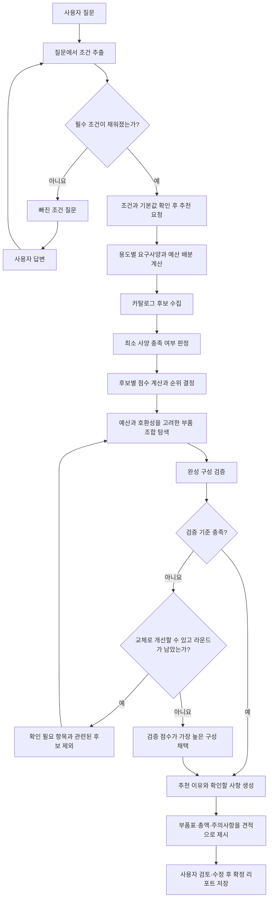

# TrueFit 추천 엔진 알고리즘 설명

작성일: 2026-10-01 · 기준: 현재 저장소 구현, PC 정책 `computer-rules-v11`

조건 대화·견적 예시 보강일: 2026-10-02

이 문서는 TrueFit이 사용자의 질문을 이해하고, 필요한 조건을 모아 PC 부품 견적을 만드는 과정을 설명한다. 사전 지식 없이 읽는다면 1장의 전체 흐름과 대화 예시, 2.1절의 조건 정리, 8.2절의 완성 견적을 먼저 읽으면 된다. 4장의 점수 계산과 5장의 조합 예시는 그 부품을 선택한 이유를 더 자세히 설명한다. **예시의 상품명·가격·스펙은 계산을 설명하기 위한 가상 데이터이며, 실제 판매 상품이나 성능 측정 결과가 아니다. 대화와 결과 문구도 이해를 돕기 위한 예시이며 실제 응답 문구는 달라질 수 있다.**

현재 실행되는 알고리즘을 기준으로 작성했다. 리뷰 속성 적합도와 같은 후속 설계는 10장에서 따로 설명한다.

## 1. 추천은 어떻게 만들어지는가?

**사용자의 요구를 최소 사양으로 바꾸고, 후보별 적합도를 계산한 뒤, 예산 안에서 서로 호환되는 부품 조합을 찾는다.**

예를 들어 “200만 원 안에서 QHD 게임용 컴퓨터를 가성비 위주로 추천해 주세요”라는 요청은 다음 순서로 처리된다.



부품 하나가 좋아도 다른 부품과 함께 사용할 수 없으면 원하는 PC가 되지 않는다. 따라서 **부품별 1위를 모으는 단계와 완성 구성을 선택하는 단계는 다르다.**

| 용어 | 의미 | 예시 |
|---|---|---|
| 슬롯 | 부품을 넣을 자리 | CPU, GPU, RAM, 메인보드, 저장장치, 파워, 케이스, 쿨러 |
| 후보 | 슬롯에 들어갈 수 있는 상품 | GPU A, GPU B |
| 요구사양 | 후보가 만족해야 하는 조건 | GPU 등급 7 이상, VRAM 12GB 이상 |
| 적합도 점수 | 여러 기준을 합친 후보의 비교 점수 | 가격·성능·리뷰 등을 합쳐 0.434 |
| 호환성 | 선택한 부품끼리 함께 쓸 수 있는지 | GPU 길이가 케이스 허용 길이 이하 |
| 견적 | 선택한 상품의 수량·가격과 총액을 정리한 구매 구성 | 부품 8종, 총 170만 원 |

PC 부품 이름이 낯설다면 CPU는 계산을 처리하는 중앙처리장치, GPU는 게임 화면 등을 그리는 그래픽카드, RAM은 작업 중인 데이터를 잠시 보관하는 메모리로 이해하면 된다. 메인보드는 부품을 연결하고, 저장장치는 파일을 보관한다. 파워는 전원을 공급하며, 케이스는 부품을 담고, 쿨러는 열을 식힌다. 이 부품들이 함께 작동해야 하므로 각각의 성능과 가격뿐 아니라 서로 맞는지도 확인한다.

QHD는 화면 해상도, 165Hz는 화면이 1초에 갱신되는 횟수를 나타낸다. VRAM은 GPU가 사용하는 전용 메모리다. 이 문서의 목표 해상도·주사율은 요구사양을 정하는 입력이며, 모든 게임에서 그 주사율만큼의 화면을 실제로 그릴 수 있다고 보장하는 값은 아니다.

핵심 선택 로직은 규칙과 수치 계산으로 실행된다. LLM(자연어를 해석하고 문장을 생성하는 AI 모델)은 설정에 따라 조건 대화와 설명 문장 작성에 사용하며, 후보 점수나 호환성 판정을 직접 정하지 않는다.

### 1.1 질문 하나가 견적이 되는 예

사용자가 **PC 본체** 카테고리를 선택한 뒤 다음과 같이 말한다고 하자.

> 사용자: “200만 원 안에서 게임용 컴퓨터를 추천해 주세요.”
>
> 도우미: “새로 만들까요, 업그레이드할까요?”
>
> 사용자: “새로 조립할 거예요. QHD 165Hz로 쓸 거고, 가성비가 중요해요.”
>
> 도우미: “새 조립, 게임용, 최대 200만 원, 가성비 우선으로 정리했어요. 목표는 QHD 165Hz예요. 추천을 받아볼 수 있어요.”

첫 질문으로 알 수 있는 것은 **게임용**과 **예산 상한 200만 원**이다. 기존 컴퓨터의 일부만 바꾸려는지, 새로 한 대를 만드는지는 알 수 없어 구성 방식을 묻는다. 두 번째 답변에서 새 조립·목표 해상도·우선순위가 함께 채워지므로 이미 답한 내용을 다시 하나씩 묻을 필요는 없다.

이후 사용자가 추천을 요청하면 다음처럼 진행된다.

| 순서 | 처리하는 일 | 이 예시에서의 의미 |
|---|---|---|
| 1. 조건 정리 | 대화 내용을 항목별로 정리 | 새 조립 / 게임 / 200만 원 / QHD 165Hz / 가성비 |
| 2. 요구사양 계산 | 용도를 부품이 갖춰야 할 기준으로 변환 | GPU 등급 7 이상, VRAM 12GB 이상 등 |
| 3. 후보 평가 | 카탈로그에서 기준에 맞는 상품을 찾고 점수 계산 | GPU A와 B가 기준을 충족하며, 가성비 점수는 A가 더 높음 |
| 4. 조합·검증 | 예산 안에서 서로 맞는 한 벌을 찾고 재검사 | GPU A는 케이스 S에 들어가지 않으므로 케이스 L과 조합 |
| 5. 견적 제시 | 선택한 부품·수량·가격·이유·주의사항을 정리 | 총 170만 원, 예산 잔액 30만 원인 구성 제시 |

이 예시의 점수 계산은 4.3절, 조합 비교는 5.2절, 완성된 견적표는 8.2절에 이어진다. **200만 원은 쓸 수 있는 상한이지 반드시 채워야 하는 금액이 아니다.** 조건을 만족하는 조합 중 점수가 높은 구성을 고르므로 예산이 남을 수 있다.

### 1.2 대화 도우미와 추천 엔진의 역할

대화 도우미는 “무엇을 원하는가?”를 정리한다. 예를 들어 “가성비가 중요해요”를 우선순위로, “200만 원 안에서”를 예산 상한으로 옮긴다. LLM을 사용할 수 없는 설정이거나 호출에 실패하면 정해진 표현을 찾는 규칙으로 조건을 추출한다. 선택지로 답하거나 조건 항목을 직접 수정하는 방법도 있다.

추천 엔진은 정리된 조건을 받아 “어떤 부품 조합이 맞는가?”를 계산한다. 최소 사양, 가격, 점수, 호환성은 정해진 규칙으로 판단한다. 마지막으로 설명 단계가 선택 결과와 계산 근거를 문장으로 풀어준다. 따라서 자연스러운 설명 문장이 만들어졌다는 사실만으로 성능이나 호환성이 보장되는 것은 아니며, 견적의 검사 결과와 확인 필요 항목도 함께 읽어야 한다.

## 2. 사용자 조건을 요구사양으로 변환한다

### 2.1 입력을 구조화한다

자유로운 문장을 그대로 부품 검색에 넣는 대신, 추천에 사용할 조건표로 정리한다. 1.1절의 대화는 다음과 같이 정리된다.

| 조건 | 정리한 값 | 값을 얻은 근거 |
|---|---|---|
| 카테고리 | PC 본체 | 사용자가 선택 |
| 구성 방식 | 새 조립 | “새로 조립할 거예요” |
| 용도 | 게임 | “게임용 컴퓨터” |
| 최대 예산 | 2,000,000원 | “200만 원 안에서” |
| 목표 해상도·주사율 | QHD 165Hz | “QHD 165Hz로 쓸 거고” |
| 우선순위 | 가성비 | “가성비가 중요해요” |
| 소음 민감도 | 민감하지 않음 | 별도 답변이 없어 기본값 적용 |
| CPU 브랜드 선호 | 지정 없음 | 별도 답변이 없어 기본값 적용 |

여기서 **사용자가 말한 조건과 시스템이 적용한 기본값은 구분한다.** 소음을 언급하지 않았다는 것은 “소음은 상관없다고 답했다”는 뜻이 아니다. 현재 계산에 기본값을 사용하며, 사용자는 나중에 바꿀 수 있다. 화면에 노출되는 기본값 조건은 가정 상태로 표시한다.

새 조립에서 반드시 필요한 조건은 **구성 방식·용도·최대 예산·우선순위**다. 빠진 필수 조건은 정해진 질문 순서에 따라 묻고, 이미 받은 조건은 유지한다. 업그레이드는 바꿀 부품도 필요하며, 교체 대상에 따라 유지할 부품의 CPU 플랫폼·RAM 규격·파워 용량을 추가로 확인한다. 이때 제공되는 “모르겠어요”도 답으로 받아들이지만, 확인하지 못한 사양은 결과의 확인 필요 사항으로 남을 수 있다.

해상도처럼 기본값이 있는 선택 조건은 사용자가 모두 답하지 않아도 추천을 시작할 수 있다. 예를 들어 목표 해상도를 말하지 않으면 현재 기본값인 FHD 144Hz를 사용하므로, 실제 목표가 QHD라면 추천 전에 수정하는 것이 좋다. **필수 조건을 채웠다는 것은 계산을 시작할 수 있다는 뜻이며, 예산 안에서 원하는 성능을 반드시 달성할 수 있다는 뜻은 아니다.**

조건 변경과 조건 간 충돌도 구분해야 한다. “예산을 180만 원으로 바꿀게요”는 예산 값을 수정하는 요청이다. 반면 낮은 예산과 높은 목표 사양을 함께 지정하면 각각 유효한 조건이어도 가능한 구성이 없을 수 있다. 이 경우 예산 사전 검토와 조합 탐색에서 부족을 안내한다. 현재 흐름이 이런 충돌을 모두 대화로 자동 해결하거나 사용자 동의 없이 예산·목표를 바꾸는 것은 아니다.

“흰색 케이스”처럼 자유 조건으로 기록할 수 있지만 현재 PC 자동 구성 점수에 반영되지 않는 요구도 있다(11장). 조건을 저장하는 것과 선택 기준으로 실제 적용하는 것은 구분해야 한다.

위 조건을 내부 항목 이름으로 표현하면 다음과 같다. 이 표현을 외울 필요는 없으며, 같은 조건이 이후 계산 단계에 전달된다는 뜻이다.

```json
{
  "category": "computer",
  "mode": "build",
  "purpose": "game",
  "budget_max": 2000000,
  "resolution": "QHD_165",
  "priority": "value",
  "noise_sensitive": false,
  "brand_pref": "none"
}
```

용도는 게임·창작·사무·학습·기타이고, 구성 방식은 새 조립 또는 업그레이드다. 우선순위는 성능·가성비·저소음 중 선택한다. 필수 조건을 채운 뒤 사용자가 추천을 요청하면 그 시점의 조건으로 계산한다. 대화 중 조건을 채우는 단계와 실제 추천 계산을 실행하는 단계는 구분된다.

### 2.2 용도와 해상도로 최소 사양을 정한다

게임용 기본 요구는 다음과 같다. `perf_tier`는 성능을 비교하기 위한 1~10 등급이다.

| 목표 | GPU 최소 등급 | CPU 최소 등급 | RAM 최소 용량 | GPU VRAM 최소 용량 |
|---|---:|---:|---:|---:|
| FHD 144Hz | 6 | 6 | 16GB | 8GB |
| QHD 165Hz | 7 | 5 | 16GB | 12GB |
| 4K | 9 | 5 | 32GB | 16GB |

게임 제목이 인식되면 해상도 요구와 해당 게임의 요구 중 **항목별로 더 큰 값**을 사용한다. 예를 들어 QHD 조건의 CPU 하한은 5지만, 사이버펑크의 CPU 하한은 6이므로 최종 CPU 하한은 6이다. 여러 게임을 선택해도 각 항목의 최댓값을 취한다. 표에 없는 게임은 해상도 기준을 유지하고 미해결 조건으로 기록한다.

사무·학습·창작·기타 용도는 별도 프로필을 쓴다. 예를 들어 사무용은 DDR4와 DDR5를 모두 허용하고 저장장치 최소 용량을 500GB로 낮춘다. 창작용은 CPU 등급 8, RAM 32GB를 요구한다.

현재 DB 카탈로그의 CPU·GPU 등급은 제조사 라인업을 등급표로 변환한 대용값이다. 같은 등급 안의 세대·모델 차이를 정밀하게 구분하지 못하며, 목표 해상도의 실제 FPS를 보장하는 값도 아니다. 게임 제목별 요구 등급도 현재 정책에서는 잠정값으로 관리한다.

### 2.3 파워 요구를 계산한다

게임용 기본 정책은 다음과 같다.

```text
예상 소비전력 = CPU 125W + GPU 300W + 기타 75W = 500W
여유를 둔 필요 용량 = 500W × 1.5 = 750W
최소 파워 용량 = 필요 용량 이상인 표준 용량 중 가장 작은 값 = 750W
```

게임용 기본 요구에는 DDR5 RAM, NVMe 저장장치 1,000GB 이상, Gold 이상 파워 등도 포함된다. 이것은 모든 용도에 일괄 적용하는 조건이 아니라 해당 용도의 정책값이다.

이 단계는 **후보를 보기 전의 예상치**를 쓴다. 완성 구성에서는 선택한 CPU의 최대 전력(없으면 TDP)과 GPU 소비전력을 실제 스펙으로 다시 비교한다. 현재 조합 검사의 기본 전력식은 `CPU 전력 + GPU 전력 ≤ 파워 용량 × 0.9`이며, 앞의 요구사양 계산과 달리 기타 부하 75W를 별도로 더하지 않는다.

### 2.4 예산을 슬롯별 참고 금액으로 나눈다

게임용 200만 원 예산의 기본 배분은 다음과 같다.

| 슬롯 | 배분 비율 | 참고 금액 |
|---|---:|---:|
| GPU | 40% | 800,000원 |
| CPU | 18% | 360,000원 |
| 메인보드 | 10% | 200,000원 |
| RAM | 8% | 160,000원 |
| 저장장치 | 7% | 140,000원 |
| 파워 | 8% | 160,000원 |
| 케이스 | 5% | 100,000원 |
| 쿨러 | 4% | 80,000원 |

배분 금액은 후보의 가격 점수를 계산하는 기준이다. GPU가 80만 원을 넘었다고 즉시 탈락하지는 않는다. 최종 조합 탐색에서 전체 구매 금액을 200만 원과 비교한다. 용도가 달라지면 배분도 달라진다.

## 3. 후보를 수집하고 최소 사양을 검사한다

### 3.1 카탈로그를 읽는다

실제 추천 서비스는 DB에서 상품·가격·스펙을 읽는다. 필요한 슬롯에 가격이 확인된 후보가 없으면 `catalog_incomplete` 오류를 반환한다.

개발용 시나리오 실행은 별도 경로다. DB 조회가 실패하거나 카탈로그가 비어 있으면 합성 카탈로그로 대체할 수 있고, `CATALOG_SOURCE=mock`이면 합성 카탈로그를 직접 사용한다. 이 동작을 실제 추천 서비스의 데이터 대체 정책으로 해석하면 안 된다.

### 3.2 예산이 가능한지 미리 살펴본다

요구사양을 확정적으로 위반하지 않는 후보 중 슬롯별 최저가를 더한다. 예를 들어 최저가 합계가 210만 원이고 예산이 200만 원이면 예산 부족을 안내한다. 최저가 합계가 예산의 85%를 초과하면 빠듯한 예산으로 분류한다.

이 계산은 슬롯 간 호환성을 아직 보지 않으므로 낙관적인 하한 추정이다. 합계가 예산 안에 들어와도 호환되는 조합이 있다는 뜻은 아니다. 채울 수 없는 슬롯이 있으면 합계에서 빠지므로 그 사실도 별도로 안내한다.

### 3.3 Pass·Fail·Pending으로 구분한다

QHD 게임용 GPU를 검사한다고 가정하자.

| 후보 | 성능 등급 | VRAM | 판정 | 이유 |
|---|---:|---:|---|---|
| GPU A | 7 | 12GB | Pass | 두 요구를 모두 충족 |
| GPU B | 8 | 16GB | Pass | 두 요구를 모두 충족 |
| GPU C | 6 | 12GB | Fail | 등급 7 미만 |
| GPU D | 정보 없음 | 12GB | Pending | 성능 등급을 확인할 수 없음 |

여러 조건이 섞이면 `Fail > Pending > Pass` 순서로 판정한다. 알려진 스펙이 조건을 어기면 Fail이고, 위반은 없지만 필요한 정보가 없으면 Pending이다.

현재 후보 유지 규칙은 다음과 같다.

- Pass가 3개 이상이면 Pass만 남긴다.
- Pass가 3개 미만이면 Pass와 Pending을 남긴다.
- 둘 다 없으면 원래 판정된 후보 목록을 다음 단계로 넘기고 하드 조건 완화 필요 로그를 남긴다.

마지막 항목은 현재 코드의 예외 경로다. **모든 후보가 탈락했을 때 요구사양을 자동으로 다시 계산하는 구현은 없으며, Fail 후보가 후속 단계로 넘어갈 수 있다.** 따라서 하드 필터가 항상 모든 최소 사양을 보장한다고 설명할 수는 없다.

## 4. 남은 후보의 점수를 계산한다

### 4.1 점수는 축별 가중합이다

```text
후보 점수 = Σ(축별 가중치 × 축별 값)
          − Pending 감점
          − 검사 스펙 결손 감점
          + RAM 다중 모듈 보너스
```

최종 후보 점수는 소수 셋째 자리로 반올림한다. 이것은 후보끼리 비교하는 값이며, 성공 확률이나 벤치마크 점수가 아니다.

| 평가 축 | 현재 계산 방식 | 해석 |
|---|---|---|
| 가격 | `max(0, 1 − 상품 가격 / 슬롯 참고 예산)` | 슬롯 참고 금액보다 저렴할수록 높음 |
| 성능 | `min(1, 성능 등급 / 10)` | 등급이 높을수록 높음 |
| 밸런스 | 이상 등급이 있으면 `1 − abs(후보 등급 − 이상 등급) / 4`, 없으면 0.5 | 목표 등급에 가까울수록 높음 |
| 리뷰 | 관측 없음 0.5 / 관측 있고 기준 미만 0.75 / 기준 이상 지표 있음 0.25 | 현재는 리뷰 작성 패턴의 관측 신호 |
| 호환여유 | CPU·GPU는 기준 전력 대비 여유, 파워는 최소 요구 대비 추가 용량, 정보가 없거나 다른 슬롯이면 0.5 | 후보 자체의 전력 여유 |
| 소음 | CPU·GPU 소비전력과 쿨러 유형으로 추정, 정보가 없으면 0.5 | 낮은 발열 등 물리적 대용값 |

밸런스의 **이상 등급**과 하드 필터의 **최소 등급**은 다르다. QHD 게임용의 이상 등급은 GPU 7.5, CPU 5.5다. 게임 요구가 이보다 높은 경우에는 해당 이상 등급도 요구 하한까지 올린다.

성능 등급이 스펙에 없으면 점수 계산에서는 5를 사용한다. 최소 등급 판정에 필요한 값이 없다는 사실은 별도로 Pending에 반영된다. 밸런스 식에는 하한 제한이 없어 이상 등급과 차이가 4를 넘으면 음수가 될 수 있다.

호환여유는 아직 선택되지 않은 상대 부품과의 실제 호환성을 뜻하지 않는다. 예를 들어 GPU 소비전력 200W, 요구사양의 GPU 기준 전력 300W이면 `1 − 200/300 ≈ 0.333`이다. 조합의 실제 호환성은 5장에서 검사한다.

### 4.2 사용자 우선순위에 따라 가중치를 바꾼다

| 우선순위 | 가격 | 성능 | 밸런스 | 리뷰 | 호환여유 | 소음 |
|---|---:|---:|---:|---:|---:|---:|
| 기본값 | 0.35 | 0.25 | 0.15 | 0.20 | 0.05 | 0.00 |
| 성능 | 0.10 | 0.55 | 0.10 | 0.20 | 0.05 | 0.00 |
| 가성비 | 0.50 | 0.15 | 0.10 | 0.20 | 0.05 | 0.00 |
| 저소음 | 0.25 | 0.15 | 0.10 | 0.20 | 0.05 | 0.25 |

각 행의 합은 1이다. `noise_sensitive=true`이면 소음 가중치를 최소 0.15로 올리고, 다른 축은 같은 비율로 줄인다. 이미 저소음 우선순위로 소음 가중치가 0.25라면 추가 조정하지 않는다.

예를 들어 가성비 가중치에서 소음 민감을 켜면 가격 0.425, 성능 0.1275, 밸런스 0.085, 리뷰 0.17, 호환여유 0.0425, 소음 0.15가 된다. 리뷰 가중치도 함께 줄어든다.

### 4.3 GPU A와 B의 점수를 직접 계산해 보자

조건은 QHD 게임용, 총예산 200만 원, 가성비 우선이다. GPU 참고 예산은 80만 원, 이상 등급은 7.5다. 두 후보는 Pass이며, 리뷰 관측은 없고, 추가 감점은 없다고 가정한다.

| 항목 | GPU A | GPU B |
|---|---:|---:|
| 가격 | 600,000원 | 720,000원 |
| 성능 등급 | 7 | 8 |
| 소비전력 | 200W | 250W |
| 가격 축 | `1 − 600000/800000 = 0.25` | `1 − 720000/800000 = 0.10` |
| 성능 축 | 0.70 | 0.80 |
| 밸런스 축 | `1 − 0.5/4 = 0.875` | `1 − 0.5/4 = 0.875` |
| 리뷰 축 | 0.50 | 0.50 |
| 호환여유 축 | `1 − 200/300 ≈ 0.3333` | `1 − 250/300 ≈ 0.1667` |

```text
A = 0.50×0.25 + 0.15×0.70 + 0.10×0.875 + 0.20×0.50 + 0.05×(1−200/300)
  ≈ 0.434167 → 최종 점수 0.434

B = 0.50×0.10 + 0.15×0.80 + 0.10×0.875 + 0.20×0.50 + 0.05×(1−250/300)
  ≈ 0.365833 → 최종 점수 0.366
```

가성비 요청에서는 A가 앞선다. 같은 후보를 **성능 우선** 가중치로 계산하면 A는 0.614, B는 0.646이므로 B가 앞선다. 사용자 조건이 후보 순위에 반영되는 방식이다.

### 4.4 감점과 보너스도 적용한다

- **Pending 감점:** 최종 가중합에서 0.20을 뺀다. 점수에 0.8을 곱하는 20% 할인 방식이 아니다.
- **검사 스펙 결손 감점:** 설정된 검사 키가 없으면 키당 0.10, 후보당 최대 0.20을 뺀다. 해당 슬롯의 다른 후보 중 하나라도 그 키를 가지고 있을 때만 적용한다.
- **RAM 보너스:** 총용량이 요구 최소 용량과 정확히 같고 모듈이 2개 이상이면 0.05를 더한다. 예를 들어 16GB 요구에 8GB×2 키트가 해당한다. 더 큰 용량이라는 이유로 이 보너스를 주지는 않는다.

점수 계산 후 GPU·CPU는 상위 5개, 다른 슬롯은 상위 3개를 우선 조합 후보로 남긴다. 전체 점수 순위도 보관해 필요할 때 탐색 범위를 넓힌다. PC 후보 점수 동점은 입력 순서를 유지하고, 최종 조합 동점 규칙은 다음 장과 같다.

이상 등급이 있는 슬롯에서 1위 후보의 등급이 이상 등급보다 0.5를 초과해 낮으면 병목 힌트를 남긴다. 이것은 등급 기준의 안내이며 실제 FPS 병목 측정은 아니다.

## 5. 예산과 호환성을 함께 고려해 구성을 고른다

### 5.1 탐색의 목표와 제약

```text
목표: 선택한 부품들의 적합도 점수 합을 최대화

조건:
  필요한 슬롯마다 후보 1개 선택
  전체 가격 ≤ 예산
  알려진 스펙으로 확인되는 부품 간 비호환이 없어야 함
```

기본 8개 슬롯에 GPU·CPU 각 5개, 나머지 각 3개가 있으면 조합 수는 `5 × 5 × 3⁶ = 18,225`개다. 엔진은 **분기 한정 탐색(branch-and-bound)**으로 이를 찾는다.

부품을 하나씩 선택하면서 다음 경우에는 그 뒤의 조합을 더 보지 않는다.

1. 지금까지의 금액에 남은 슬롯의 최저가를 더해도 예산을 초과한다.
2. 선택한 부품 사이에 확정적인 비호환이 있다.
3. 남은 슬롯에서 최고 점수를 모두 얻어도 이미 찾은 구성보다 점수가 낮다.

최종 점수 합이 같으면 더 저렴한 조합을 선택하고, 가격까지 같으면 슬롯 순서의 상품 키를 비교한다.

### 5.2 부품별 1위를 그대로 고를 수 없는 예

앞의 GPU A와 B에 케이스 두 개를 추가한다. 나머지 6개 부품은 총 100만 원으로 고정하고, 관련 호환성 검사는 모두 통과한다고 가정한다. 케이스 점수는 조합 설명을 위해 가정한 값이다.

| 부품 | 가격 | 점수 | 크기 조건 |
|---|---:|---:|---|
| GPU A | 600,000원 | 0.434 | 길이 300mm |
| GPU B | 720,000원 | 0.366 | 길이 270mm |
| 케이스 S | 60,000원 | 0.520 | GPU 허용 길이 280mm |
| 케이스 L | 100,000원 | 0.470 | GPU 허용 길이 330mm |

| 조합 | 고정 부품 포함 총액 | GPU·케이스 점수 합 | 결과 |
|---|---:|---:|---|
| A + S | 1,660,000원 | 0.954 | A의 300mm가 허용 280mm를 초과하므로 제외 |
| A + L | 1,700,000원 | 0.904 | 예산과 호환성 조건을 만족, 채택 |
| B + S | 1,780,000원 | 0.886 | 가능하지만 점수 합이 더 낮음 |
| B + L | 1,820,000원 | 0.836 | 가능하지만 점수 합이 더 낮음 |

GPU 1위와 케이스 1위인 A + S는 함께 사용할 수 없다. 엔진은 케이스를 L로 바꾼 A + L을 선택한다. 나머지 부품의 점수 합은 모든 조합에 같으므로 비교 표에서 생략했다.

이 예에서 가성비 점수가 가장 높은 조합은 170만 원이다. 예산을 모두 쓰는 것 자체가 목표가 아니므로 30만 원이 남을 수 있다. 실제 서비스도 새 조립에서 가성비·저소음 우선이고 예산을 15% 이상 남기면 관련 안내를 제공한다.

### 5.3 상위 후보에서 답을 찾지 못하면?

상위 후보 조합에 예산 내 호환 구성이 없으면 보관한 전체 후보 풀로 넓혀 다시 찾는다. 확대 탐색은 탐색 노드 수 150,000개로 제한하고, 제한 도달 사실을 기록한다.

그래도 예산 내 구성을 찾지 못하면 탐색 범위에서 찾은 가장 저렴한 호환 구성을 반환하고 예산 초과로 표시할 수 있다. 호환 구성 자체를 찾지 못하면 상위 후보에서 확정 비호환 수 등으로 비교한 대체 구성을 반환하고 세트 실패로 표시한다. 이것은 정상 조건을 만족한 추천이 아니다.

따라서 “모든 상품을 대상으로 항상 전역 최적해를 찾는다”는 설명은 맞지 않는다. 정상 경로는 상위 후보 안에서 최적 조합을 찾으며, 전체 풀 확대는 그 범위에서 해가 없을 때만 실행한다. 확대 탐색이 제한에 도달하면 발견한 최선의 결과가 사용될 수 있다.

## 6. 완성 구성을 검증하고 필요하면 재탐색한다

### 6.1 무엇을 검사하는가?

대표적인 조합 검사는 다음과 같다.

| 검사 | 예시 |
|---|---|
| CPU·메인보드 소켓 | AM5 CPU와 AM5 메인보드인가? |
| RAM·메인보드 규격 | DDR5 RAM을 DDR5 메인보드에 넣는가? |
| 메인보드·케이스 크기 | 케이스가 해당 메인보드 크기를 수용하는가? |
| GPU·쿨러 크기 | GPU 길이와 공랭 쿨러 높이가 케이스 제한 이하인가? |
| 쿨러 소켓·라디에이터 | CPU 소켓을 지원하고 수랭 라디에이터가 들어가는가? |
| CPU 지원 계열 | 메인보드 지원 CPU 계열에 포함되는가? |
| 전력·파워 | CPU·GPU 전력에 비해 파워 용량이 충분한가? |
| 파워·GPU 전원 | 파워 크기·길이와 GPU 전원 커넥터 종류·개수가 맞는가? |
| 메모리·저장장치 연결 | RAM 개수·용량과 M.2 슬롯이 맞는가? |
| 동작 속도 | RAM·SSD가 보드 한계 때문에 낮은 속도로 동작하는가? |

스펙을 모르면 확인 필요로 남긴다. RAM 속도 초과나 전원 어댑터 필요도 바로 확정 비호환으로 단정하지 않는다. 출고 BIOS 버전처럼 현재 데이터에 없는 사항은 지원 계열만으로 보장하지 않는다.

일부 확장 검사(파워 길이, GPU 슬롯 두께, 라디에이터, RAM 슬롯·속도, M.2)는 데이터가 없어 판정하지 못했을 때 상세 결과에는 남지만 검증 감점에서는 제외한다. 따라서 확인할 수 없는 모든 검사 항목이 같은 방식으로 감점되는 것은 아니다.

### 6.2 검증 점수를 계산한다

실제 서비스의 내부 검증 점수는 `max(0, 100 − 쟁점 감점 합)`이다.

| 쟁점 | 감점 |
|---|---:|
| 확정 비호환 또는 세트 실패 | 항목당 20 |
| 감점 대상인 확인 필요 항목 | 항목당 6 |
| 예산 초과 | 20 |
| 예산 사용률이 110%를 초과 | 추가 15 |

80 이상이면 내부 통과 기준을 만족한다. 예산 초과에 해당하는 두 감점이 함께 적용되면 쟁점은 하나로 합치고 감점 합계 35를 유지한다.

이 값은 규칙으로 만든 내부 제어값이다. 구매 성공 확률이나 안전 확률이 아니며, 현재 통과 여부는 점수만으로 정한다. 확정 위반 1건만 있으면 `100 − 20 = 80`이므로 내부 기준을 만족할 수 있고, 확인 필요 항목이나 예산 초과가 남을 수도 있다. 사용자 설명에서는 개별 쟁점을 확인해야 한다.

### 6.3 재탐색 예시

다른 감점은 없고 감점 대상 확인 필요 항목만 있다고 가정하자.

```text
1라운드: 확인 필요 4건 → 100 − 4×6 = 76 → 기준 미달
          케이스의 스펙 결손 관련 쟁점을 확인
          이번에 선택한 케이스 후보를 제외하고 다시 조합

2라운드: 확인 필요 3건 → 100 − 3×6 = 82 → 기준 충족
          2라운드 구성을 채택하고 남은 확인 필요 항목을 안내
```

최대 3라운드에는 최초 구성도 포함된다. 매번 후보를 새로 수집하거나 모든 점수를 다시 계산하는 대신, 제외 목록을 적용해 조합 탐색과 검증을 반복한다.

실제 서비스는 확인 필요 쟁점의 감점이 큰 순서로 제외 대상을 찾는다. 그 쟁점에서 스펙이 누락된 슬롯의 **실제로 선택한 후보**를 제외한다. 성능 저하를 피하기 위해 CPU·GPU와 유지 중인 보유 부품은 제외 대상으로 삼지 않는다. 예산·세트 실패만 남아 있거나 바꿀 후보가 없으면 조기에 멈춘다.

실행한 라운드 중 검증 점수가 가장 높은 구성을 채택하고, 동점이면 앞 라운드를 선택한다. 개선되지 않은 마지막 라운드가 자동으로 최종 결과가 되는 것은 아니다.

## 7. 업그레이드는 무엇이 다른가?

업그레이드 모드는 바꿀 부품만 구매 대상으로 삼고, 유지할 부품은 호환성 검사에 사용한다.

예를 들어 “GPU와 파워만 교체, 예산 80만 원”이라면 기본 배분에서 두 슬롯의 비율만 남기고 다시 정규화한다.

```text
GPU 배분 = 0.40 / (0.40 + 0.08) = 약 83.33%
파워 배분 = 0.08 / (0.40 + 0.08) = 약 16.67%

슬롯 참고 예산: GPU 약 666,666원 / 파워 약 133,333원
```

유지할 메인보드·RAM·케이스 등은 구매 총액에 넣지 않는다. 보유 사양을 카탈로그 또는 입력에서 확인해 요구사양을 제한하고, 조합 검사는 유지 부품도 함께 참조한다.

현재 CPU·GPU 등급을 알고 있으면 추천 하한을 적어도 그 등급까지 높이고, 현재 사용 중인 같은 제품은 선택에서 제외한다. 다만 등급이 거친 대용값이므로 이 처리만으로 실제 성능 향상을 보장하지는 않는다.

## 8. 추천 이유와 근거를 만든다

### 8.1 선택 결과를 설명한다

부품 선택이 끝나면 다음 정보를 설명으로 만든다.

- 선택한 부품, 총액, 조건과 연결된 추천 이유
- 확인한 스펙과 출처, 남아 있는 호환성 쟁점
- 리뷰 관측 여부와 순위에 사용된 신호
- 어떤 평가 축이 점수에 많이 기여했는지

축별 기여도는 선택한 부품들의 `가중치 × 축 값`을 축별로 합쳐 백분율로 계산한다. 실제 구현은 음수 기여를 0으로 처리하고, 정수 비율 합계가 100%가 되도록 보정한다. Pending·결손 감점과 RAM 보너스는 축별 값이 아니므로 이 비율에 포함하지 않는다. 따라서 기여도는 최종 점수 전체를 그대로 분해한 값이 아니다.

LLM은 확정된 수치와 부품을 받아 문장을 작성한다. 생성 실패나 초안 검증 실패 시 규칙 템플릿을 사용한다. 실제 서비스는 부품·가격·검증을 먼저 저장하고 설명을 별도로 생성하므로 설명을 만드는 동안에도 부품표를 조회할 수 있다.

실제 PC 검증의 근거는 카탈로그 스펙 출처다. 설명서 검색 RAG는 그 검증 경로에 연결되어 있지 않다. 별도의 사용 가이드 검색은 “구매 전 확인” 문구를 만드는 데 쓰며, 선택 점수나 확정 호환성 판정을 대체하지 않는다.

### 8.2 완성된 견적은 어떤 모습인가?

1.1절의 대화와 5.2절의 조합 예시를 이어서, 나머지 6개 부품의 고정 금액 100만 원을 아래처럼 나누었다고 가정하자. 이 표는 견적의 구성 요소를 설명하기 위한 예시다. 예시에서는 관련 호환성 검사를 모두 통과한 것으로 가정하며, 표에 없는 세부 스펙으로 성능을 입증하려는 것은 아니다.

| 부품 | 선택 상품 | 구매 수량 | 단가 | 품목 금액 |
|---|---|---:|---:|---:|
| CPU | CPU 예시 상품 | 1 | 300,000원 | 300,000원 |
| GPU | GPU A | 1 | 600,000원 | 600,000원 |
| RAM | RAM 예시 키트 | 1 | 140,000원 | 140,000원 |
| 메인보드 | 메인보드 예시 상품 | 1 | 200,000원 | 200,000원 |
| 저장장치 | SSD 예시 상품 | 1 | 140,000원 | 140,000원 |
| 파워 | 파워 예시 상품 | 1 | 150,000원 | 150,000원 |
| 케이스 | 케이스 L | 1 | 100,000원 | 100,000원 |
| 쿨러 | 쿨러 예시 상품 | 1 | 70,000원 | 70,000원 |
| **합계** | | | | **1,700,000원** |

```text
견적 총액 = 선택한 각 상품의 (단가 × 구매 수량)을 모두 더한 값
예산 잔액 = 2,000,000원 − 1,700,000원 = 300,000원
```

RAM의 구매 수량 1은 키트 한 상품을 산다는 뜻이며, 키트 안의 메모리 모듈 개수와는 다르다. 실제 PC 견적은 카탈로그에 기록된 판매 가격을 사용하며 가격 관측 시점도 함께 제공한다. 총액 계산은 선택 상품 금액의 합이므로 조립비나 배송비 같은 별도 비용이 자동으로 포함된다고 해석하면 안 된다.

부품표와 함께 다음과 같은 설명을 제시할 수 있다.

> “QHD 게임용 기준을 충족하는 후보 중 가성비 점수가 높은 GPU A를 선택했습니다. 저렴한 케이스 S는 GPU A가 들어가지 않아 제외하고, 길이를 수용하는 케이스 L을 선택했습니다. 부품 총액은 170만 원으로 예산에서 30만 원이 남습니다.”

실제 결과에서는 남은 확인 필요 항목도 별도로 제시한다. 예를 들어 출고 BIOS 버전을 확인할 수 없으면 구매 전 확인 사항으로 남긴다. **추천 구성 제시, 내부 검증 기준 통과, 모든 검사 항목 확인 완료는 서로 다른 상태다.** 6장에서 설명했듯 내부 기준을 통과해도 확인 필요 항목이 남을 수 있다.

### 8.3 사용자가 수정하고 확정한다

견적을 본 뒤 “그래픽카드를 GPU B로 바꾸고 싶어요”라고 요청하거나 교체 기능으로 다른 후보를 선택할 수 있다. 교체가 적용되면 현재 선택된 부품을 기준으로 총액과 호환성을 다시 확인한다. 5.2절의 예시에서 GPU A만 B로 바꾸고 케이스 L을 유지하면 총액은 `170만 원 − 60만 원 + 72만 원 = 182만 원`이다. 케이스 S로의 변경까지 자동으로 적용되는 것은 아니다.

부품 교체는 현재 견적을 수정하는 일이고, “예산을 180만 원으로 낮춰 주세요”처럼 조건을 바꾸는 일은 새 조건으로 추천을 다시 받는 일이다. 조건이 바뀌었는데 이전 조건으로 계산한 결과를 그대로 확정하려고 하면 재추천이 필요하다. 교체 후 검사 결과는 갱신하지만 기존 추천 이유 문장 전체를 자동으로 다시 작성하는 것은 아니므로, 바뀐 부품표와 검사 결과를 기준으로 확인한다.

검토를 마치면 로그인한 사용자가 견적을 확정하고 리포트로 저장할 수 있다. 선택 품목이 있고 추천이 완료되어야 하며, PC 선택 금액이 예산을 초과하면 확정할 수 없다. 따라서 5.3절의 예산 초과 대안을 보여 주는 것과 그 대안을 확정하는 것은 다르다. 확정 리포트는 당시 선택한 상품·수량·금액을 저장한 기록이므로, 이후 카탈로그 가격이 바뀌어도 당시 견적 금액을 보존한다. 견적 확정은 주문이나 결제를 실행하는 단계가 아니다.

## 9. 주변기기는 별도 경로로 처리한다

주변기기 엔진은 모니터·키보드·마우스·스피커를 처리하며 PC 본체와 다른 점수식을 사용한다.

```text
주변기기 점수 = 가격 가중치 × 가격 값
              + 선호적합 가중치 × 선호 충족 비율
              + 데이터충실 가중치 × 검사 스펙 보유 비율
              − Pending 감점
```

가격 값은 해당 종류의 후보 가격 중앙값 `M`을 기준으로 `clamp(1 − 가격/(2M), 0, 1)`로 계산한다. 예를 들어 중앙값이 10만 원이면 10만 원 후보의 가격 값은 0.5, 20만 원 후보는 0이다. 소프트 선호는 충족 1, 미충족 0, 정보 없음 0.5로 계산해 평균한다.

현재 주변기기의 리뷰 가중치는 0이다. 별도 예산이 없으면 종류별 1위를 선택하고, 있으면 각 종류의 상위 5개 조합에서 예산 내 점수 합을 최대화한다. 예산 내 조합이 없으면 그 탐색 범위의 최저가 조합을 선택하고 초과를 기록한다. 모니터는 목표 해상도와 GPU 출력 단자 등을 추가 검사한다.

이 경로는 현재 개발용 파이프라인에 연결되어 있다. 실제 `execute_recommendation()`의 PC 추천 저장 경로에는 주변기기 실행이 연결되어 있지 않다. 주변기기 가격도 판매처·관측일이 확인된 PC 구매 가격과 구분되는 참고가이며 PC 총액에 합산하지 않는다.

## 10. 현재 리뷰 점수와 후속 설계를 구분한다

### 10.1 현재 구현: 리뷰 작성 패턴의 관측 신호

현재 PC 리뷰 축은 리뷰의 정숙성·안정성 평가를 읽어서 계산하는 방식이 아니다. 사전 배치 산출물의 상품별 관측값을 대조군 중앙값과 비교한다.

```text
관측 산출물이 없거나 상품을 찾을 수 없음 → 리뷰 값 0.50
상품 관측이 있고 중앙값의 2배 이상인 지표가 없음 → 0.75
중앙값의 2배 이상인 지표가 하나라도 있음 → 0.25
```

예를 들어 특정 작성 패턴 비율이 10%, 대조군 중앙값이 3%이면 `10% ≥ 2×3%`이므로 리뷰 값은 0.25다. 임계값과 정확히 같아도 해당한다. 이것은 상품 단위의 관측 신호이며 개별 리뷰의 조작 판정이 아니다.

리뷰 가중치가 0.20이면 관측 없음의 기여는 0.100, 기준 미만은 0.150, 기준 이상은 0.050이다. 다른 축이 같아도 이 값으로 후보 순위가 달라질 수 있다. 관측 산출물을 사용할 수 없으면 그 원인을 로그에 남긴다.

### 10.2 후속 설계: 리뷰 속성 적합도

[리뷰 속성 반영 계획](추천엔진_리뷰속성_반영계획.md)과 [리뷰 적합도 계산 알고리즘](추천엔진_리뷰적합도_계산알고리즘.md)은 기존 리뷰 축의 입력을 속성 적합도로 교체하는 설계다. **현재 `stage3b_rank._review_axis()`에는 이 방식이 구현되어 있지 않다.**

설계에서는 긍정 관측 수 `P`, 부정 관측 수 `N`, 중립 사전값 0.5, 완화 계수 `k`로 속성 점수 `Q`를 계산한다.

```text
Q = (P + k×0.5) / (P + N + k)
R = Σ(속성 중요도 α × 속성 점수 Q)
새 최종 점수의 리뷰 기여 = 기존 리뷰 가중치 × R
```

예를 들어 게임 부하에서 정숙성 긍정 14건, 부정 2건, `k=4`이면 `Q=(14+2)/(14+2+4)=0.8`이다. 정숙성 0.8, 발열 관리 0.7, 안정성 0.9에 중요도 0.60, 0.25, 0.15를 적용하면 `R=0.79`이고, 리뷰 가중치 0.20에서 점수 기여는 0.158이다.

이 예시는 후속 설계의 계산이다. 현재 GPU A·B 예시의 리뷰 값 0.5를 자동으로 이 값으로 교체해 해석하면 안 된다. pgvector 검색도 이 설계에서는 설명 근거를 찾는 역할이며 검색 유사도가 추천 점수가 되는 것은 아니다.

## 11. 피드백과 현재 적용 범위

결과 노출·부품 교체 등의 피드백 이벤트와 브랜드 선호 신호를 기록하는 기능이 있다. 반복 행동은 다음 세션에서 선호를 되묻는 데 사용하며, 기록이 쌓였다고 추천 가중치가 자동으로 학습·변경되는 구현은 아니다.

현재 `brand_pref`는 CPU 플랫폼의 소켓 범위를 정하는 데 사용한다. 저장된 다른 슬롯의 브랜드 선호·비선호를 후보 점수에 자동 반영하는 확장은 아직 연결되지 않았다. 관련 내용은 [사용자 선호·비선호 기록 설계](사용자_선호비선호_기록_설계.md)를 참고한다.

또한 `extra`로 저장한 자유 조건은 현재 PC 자동 구성 점수에 반영하지 않는다. “흰색 케이스”처럼 조건을 기록했다는 사실과 실제 선택에 사용했다는 사실을 구분해야 한다.

## 12. 구현을 확인할 때 볼 파일

| 내용 | 구현 파일 |
|---|---|
| 실제 추천 실행·저장 | [recommendation_service.py](../src/services/recommendation_service.py) |
| 개발용 시나리오 파이프라인 | [pipeline.py](../src/pipeline.py) |
| 조건 정의·기본값 | [computer.yaml](../config/categories/computer.yaml), [slots.py](../src/engine/slots.py) |
| 요구사양·정책값 | [stage2_requirement.py](../src/engine/stage2_requirement.py), [computer_verification_rules.yaml](../config/computer_verification_rules.yaml) |
| 후보 수집·DB 카탈로그 | [stage3_0_candidates.py](../src/engine/stage3_0_candidates.py), [catalog_repo.py](../src/repo/catalog_repo.py) |
| 예산 사전 판단 | [feasibility.py](../src/engine/feasibility.py) |
| 최소 사양 필터 | [stage3a_hardfilter.py](../src/engine/stage3a_hardfilter.py) |
| 후보 점수·순위 | [stage3b_rank.py](../src/engine/stage3b_rank.py) |
| 조합 탐색·호환성 검사 | [stage4_optimize.py](../src/engine/stage4_optimize.py) |
| 완성 구성 검증·재탐색 | [stage3c_verify.py](../src/engine/stage3c_verify.py), [research_loop.py](../src/engine/research_loop.py) |
| 업그레이드 보유 부품 처리 | [owned_parts.py](../src/engine/owned_parts.py) |
| 추천 설명·축별 기여도 | [stage5_explain.py](../src/engine/stage5_explain.py) |
| 리뷰 관측 조회 | [review_repo.py](../src/repo/review_repo.py) |
| 주변기기 선택·정책 | [peripheral_select.py](../src/engine/peripheral_select.py), [peripherals.yaml](../config/peripherals.yaml) |
| 탐색·검증·감점 상수 | [config.py](../src/config.py) |

정책 숫자가 바뀌면 2·4·6장의 표와 계산 예시도 함께 갱신해야 한다. 개발용 시나리오는 검증 결과를 시나리오에서 주입할 수 있으므로, 실제 서비스 검증을 확인할 때는 `verify_set()` 대신 `verify_build()` 호출 경로를 확인한다.
