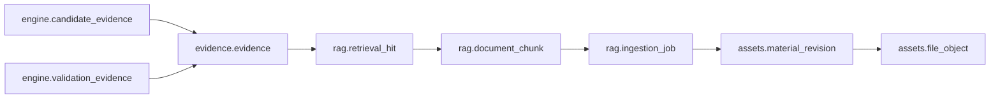
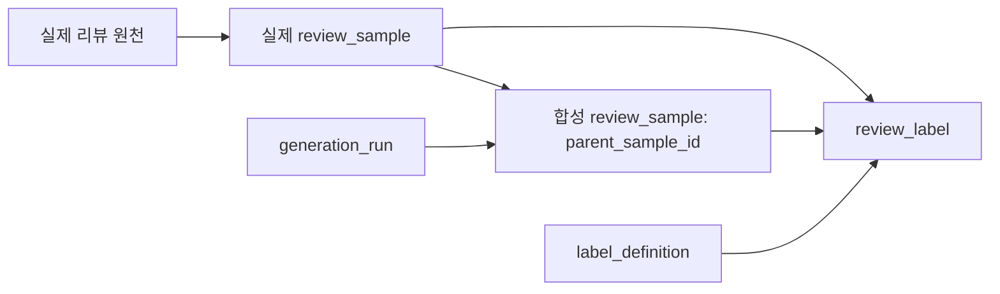

# 데이터 구조를 이렇게 설계한 이유

수정일: 2026년 9월 11일 · 개정 3 · 테이블 명세서 v4 반영

이 문서는 데이터 구조가 어떤 서비스 요구를 해결하며, 각 기록을 왜 분리했는지 설명한다. 설계 기준은 [테이블 명세서 v4](docs/db/table_spec.md)(2026년 9월 10일)다.
컬럼·타입·제약·상태값의 상세 정의와 이 문서가 다르면 테이블 명세서를 우선한다. 기존 목업과 schema-v2.json은 이전 버전 참고 자료이며 현재 설계와 동기화된 것으로 간주하지 않는다.

**현재 설계는 PostgreSQL + pgvector + 객체 저장소, 12개 스키마·58개 테이블이다.** 이번 개정은 기존 45개 테이블 설명을 v4에 맞춰 정리하고, PC 직접 작성 리뷰, 리뷰 데이터셋과
정답 라벨, 사용자 행동 기록의 설계 근거를 반영했다. 이 문서는 구현 전 설계 설명이며 DB 적용·마이그레이션·서비스 테스트 완료 보고서가 아니다.

## 1. 현재 범위와 구조가 답해야 할 질문

PC 본체 조립과 아기 용품 준비를 지원한다. 사용자의 조건으로 필요한 물품을 구성하고, 상품·판매 정보와 자료 근거를 확인한 뒤 확정·가격 추적으로 연결한다. 결제는 외부 쇼핑몰에서 진행하므로 구매 항목은 주문이나
구매 완료 기록이 아니다.

| 서비스가 답해야 할 질문                                  | 필요한 기록                             |
|----------------------------------------------------------|-----------------------------------------|
| 사용자가 무엇을 원하며 어떤 조건을 바꿨는가?             | 대화·메시지·계획 조건·정의 버전         |
| 상품을 고르기 전 무엇이 필요한가?                        | 슬롯·필요 항목·수량·필요 시점           |
| 보유품으로 충족했는가, 구매해야 하는가?                  | 보유 물품·구매 항목·충족 연결           |
| 어떤 옵션을 어느 판매처에서 얼마에 제안했는가?           | 상품·옵션·판매 제안·가격 관측           |
| 왜 추천하거나 호환성을 판정했는가?                       | 추천 실행·후보·검사·출처·인용 근거      |
| 어느 설명서 개정판의 어느 위치를 사용했는가?             | 파일·자료 버전·추출 작업·청크·검색 결과 |
| 부품 평가인가, 실제 사용한 전체 PC 평가인가?             | 리뷰 대상·조립 구성 버전·리뷰 본문 버전 |
| 학습 데이터가 실제인지 합성인지, 정답은 누가 판단했는가? | 표본·부모·생성 실행·라벨 정의·검수 이력 |
| 사용자가 추천을 보고 어떤 행동을 했는가?                 | 노출·교체·제외·확정 이벤트              |
| 확정 당시 금액과 현재 가격이 어떻게 다른가?              | 확정 버전·가격 판정·알림 이벤트         |

같이 생성되고 변경되는 기록은 묶고, 변경 주기와 책임이 다른 기록은 분리한다. 58개 테이블에는 연결 테이블도 포함되며 58개 서버나 서비스가 필요하다는 뜻은 아니다.

### 범용 구조와 초기 구현 범위를 구분한다

| 항목      | 이번 구현                                                  | 보류 범위                                            |
|-----------|------------------------------------------------------------|------------------------------------------------------|
| 도메인    | pc_build, baby_prep                                        | 요리·레시피·인분·재료 합산·잔량 계산                 |
| 계획 계층 | 최상위 group → slot 또는 최상위 slot                       | group 중첩·임의 깊이 편집                            |
| 보유 충족 | 필요량 전체를 보유했다는 확인                              | 부분 보유와 구매의 혼합 배분                         |
| RAG       | 추천·검증 중 검색, 활성 텍스트 임베딩 모델 하나            | 독립 설명서 검색·동시 다중 모델·native 이미지 임베딩 |
| 리뷰 증강 | 실제 train 표본 하나에서 합성 자식 여러 개                 | 다중 부모·합성본 재증강·원천 없는 생성               |
| 라벨      | 세 가지 리뷰 근거 판정, 학습 표본 검수·실제 평가 사람 검수 | 별도 감성 과제·범용 라벨 편집 관리 화면              |
| 피드백    | 노출·교체·제외·확정 로깅                                   | 자동 재학습 배치                                     |

향후 확장을 위한 컬럼이 있다는 이유로 보류 기능을 필수 구현으로 확대하지 않는다. PC 보유 부품 선택 UI도 이번 명세만으로 추가되는 기능이 아니다.

## 2. 왜 하나의 DB 안에서 업무를 나누는가

계획·상품·추천 근거·리뷰 사이의 관계가 많으므로 운영 DB 하나에서 시작한다. 스키마는 같은 DB 안에서 책임을 나누는 구획이다. 별도 권한 설정 없이 접근이 자동 격리되는 것은 아니다.

| 스키마       | 테이블 수 | 분리한 책임                        |
|--------------|----------:|------------------------------------|
| config       |         2 | 도메인과 게시 정의                 |
| identity     |         4 | 계정·설정·대화·메시지              |
| shared       |         1 | 단위                               |
| planning     |         8 | 계획·조건·구매·보유·충족           |
| catalog      |         8 | 상품·옵션·판매·가격·근거 속성      |
| assets       |         4 | 원본 파일·상품 자료·개정·적용 범위 |
| rag          |         6 | 추출·청크·임베딩·검색 이력         |
| community    |         5 | 실제 사용 PC 구성·직접 작성 리뷰   |
| evidence     |         6 | 출처·인용·리뷰 대상·요약·집계      |
| engine       |         7 | 추천·검증·근거 연결·사용자 행동    |
| notification |         3 | 가격 추적·판정·발송                |
| dataset      |         4 | 생성 실행·표본·라벨 정의·정답 이력 |
| **합계**     |    **58** | **테이블 명세서 v4 기준**          |

원본 파일과 파생 이미지는 객체 저장소에, 관계·메타데이터와 벡터는 PostgreSQL에 둔다. 초기 벡터 저장은 pgvector로 정해져 있으며 별도 벡터 DB 선택을 선행 조건으로 두지 않는다. 모델 차원 D는
선정 후 vector (D)와 함께 확정할 물리 설계 파라미터다.

확정·포인터 교체·라벨 승인처럼 함께 성공해야 하는 변경은 짧은 DB 트랜잭션으로 묶는다. 반면 객체 업로드·OCR·모델 호출·이메일 발송은 DB와 하나의 원자 작업이 아니므로 상태·멱등 키·재시도·완료 후 재검증이
필요하다. 긴 외부 작업 동안 DB 트랜잭션을 유지하지 않는다.

## 3. 왜 도메인·상품 분류·슬롯을 구분하는가

도메인은 구매 계획의 목적, 상품 분류는 제품 종류, 슬롯은 이번 계획에서 채울 역할이다. PC 조립 도메인의 저장장치 슬롯과 SSD 상품 분류는 서로 다른 기록이다. 상품은 공통 카탈로그에 두고
product_category_membership으로 복수 분류에 연결한다.

config.domain은 지속적인 도메인 식별자이고 config.domain_version은 질문·슬롯·검증 실행기·평가 축·속성 형식의 게시 버전이다. 게시된 정의를 덮어쓰지 않아야 과거 계획에 적용한 기준을
설명할 수 있다. 계획 버전은 사용한 정의 버전을 참조한다.

대화 원문인 identity.message와 적용 조건인 planning.plan_condition도 나눈다. 명시 입력·추출·추정을 origin으로 구분하고 source_message_id와
supersedes_id로 출처·수정 이력을 연결한다. 활성 조건은 같은 계획 버전과 키에 하나만 존재해야 한다. 사용자가 예산을 바꿨을 때 이전 발화를 삭제하거나 추정값을 명시 입력으로 오인하지 않기 위한 구조다.

## 4. 왜 필요한 것과 구매·보유한 것을 나누는가

planning.requirement를 구매 항목과 독립시켜야 아직 선택하지 않은 빈 슬롯이 유지된다. planning.plan_node는 그룹·슬롯 표시 구조를, requirement는 필요량·단위·필수 여부·필요
시점을 표현한다. 제외 상태가 곧 필수 항목 충족을 뜻하지는 않는다.

planning.purchase_line은 선택한 판매 제안과 당시 가격 관측을, planning.owned_item은 계획 시점의 보유 물품을 기록한다. planning.fulfillment_allocation은
필요 항목이 어느 구매 또는 보유 항목으로 충족되는지 연결한다. 한 연결에서 구매·보유 중 정확히 하나만 지정하고 모든 대상은 같은 계획 버전에 속해야 한다.

초기에는 필요 항목당 연결 하나, 구매·보유 항목당 연결 하나만 허용한다. 젖병 4개가 필요할 때 4개를 모두 보유했다면 보유 충족으로 처리하지만 2개 보유 + 2개 구매의 혼합 배분은 지원하지 않는다. 보유 체크로
구매 비용을 줄여도 PC 호환성 검사에는 실제 규격 확인이 필요하다.

묶음 상품은 구매 수량과 충족량이 다르다. 필요량 5개, 한 묶음 2개라면 ceil (5/2)=3묶음 비용을 계산하고 충족량은 5개로 기록한다. 남은 1개를 다른 항목에 자동 배분하지 않는다. each는 정수이며
수량·단위·통화·배분 합계는 잠금 또는 수정 번호 검사와 함께 검증한다.

## 5. 왜 상품·옵션·판매 제안·가격 관측을 나누는가

catalog.product는 모델, catalog.product_variant는 구체 옵션과 포장 규격, catalog.offer는 특정 옵션의 판매처·구매 링크, catalog.offer_observation은
특정 시점의 가격·재고 기록이다. 같은 모델의 용량 차이와 같은 옵션의 판매처 차이, 같은 판매처의 시간별 가격 차이를 각각 구분한다.

purchase_line.selected_observation_id는 반드시 선택한 offer에 속해야 한다. 계획 금액은 같은 통화로 계산하며 상품명·옵션·링크의 당시 표시 정보는 스냅샷으로 남긴다. 현재 상품명이
바뀌어도 과거 확정 내역을 설명하기 위해서다.

catalog.product_fact는 출처가 있는 속성값·단위·적용 조건을 evidence.evidence에 연결한다. 현재 조회용 속성 묶음과 검증에 사용한 사실을 구분해야 설명서의 개정이나 조건 차이를 추적할
수 있다. 예를 들어 GPU 허용 길이는 전면 라디에이터 설치 여부와 함께 확인해야 하며 숫자만 비교해서는 안 된다.

## 6. 왜 계획과 확정 버전을 나누는가

planning.plan은 같은 리스트의 지속적인 식별자이고 planning.plan_revision은 편집 또는 확정 단위다. confirmed 버전의 조건·구성·금액은 고정하며 수정하기는 새 draft를 만든다.
현재 버전 포인터는 반드시 같은 plan의 버전을 가리켜야 한다.

초안의 lock_version과 추천 실행 당시 입력을 비교하면 늦게 끝난 추천이 새 조건을 덮어쓰는 일을 막을 수 있다. 예산 150만 원으로 시작한 추천 도중 사용자가 180만 원으로 변경했다면 이전 입력의
결과를 현재 결과로 적용하지 않는다.

비로그인 대화와 추천은 임시 세션 소유권으로 관리하고 로그인 후 소유 확인을 거쳐 계정에 귀속한다. 확정에는 소유자·확정 시각·확정 금액이 필요하다. 확정 성공과 plan_confirmed 행동 이벤트는 같은
트랜잭션에 기록한다.

## 7. 왜 상품 자료와 검색 처리를 나누는가

| 기록                          | 분리 이유                                                         |
|-------------------------------|-------------------------------------------------------------------|
| assets.file_object            | 실제 파일의 객체 키·해시·검사·보관 상태·사용 권한을 관리한다.     |
| assets.product_material       | 설명서·사양표·이미지 등 자료의 지속적인 정체성과 출처를 관리한다. |
| assets.material_revision      | 제조사 개정판과 현재 게시·활성 추출 작업을 구분한다.              |
| assets.material_applicability | 자료 버전이 적용되는 상품과 옵션·하드웨어 조건을 명시한다.        |
| rag.ingestion_job             | 같은 개정판을 새 파서·OCR·청크 설정으로 처리한 이력을 구분한다.   |
| rag.document_chunk            | 검색할 텍스트와 원본 페이지·이미지 영역을 연결한다.               |
| rag.embedding_profile         | 모델·고정 버전·차원·전처리 기준을 구분한다.                       |
| rag.chunk_embedding           | 청크와 프로필 조합별 벡터를 저장한다.                             |

한 설명서를 여러 모델에 연결할 수 있지만 적용 범위를 확인한 모델만 검색 근거로 사용한다. material_applicability는 product를 기준으로 하며 variant가 있으면 해당 product
소속인지 확인한다. 만료되는 signed URL을 장기 파일 식별자로 저장하지 않는다.

원본 업로드와 검사·권한 확인이 끝난 뒤 자료 버전·적용 범위를 등록하고 추출·임베딩을 수행한다. ready 작업과 필수 임베딩이 준비된 경우에만 활성 추출 작업과 현재 자료 버전 포인터를 게시 트랜잭션에서
전환한다. 실패한 파일이나 미완성 작업은 검색에 노출하지 않는다.

현재 이미지 검색은 OCR·캡션을 같은 텍스트 임베딩 경로로 처리한다. 원본 이미지와 위치도 유지한다. 생성된 캡션의 추정 수치를 제조사 확정 규격으로 사용하지 않는다. 질문과 청크는 같은 프로필을 사용하며 차원이
같아도 서로 다른 모델의 거리를 직접 비교하지 않는다.

## 8. 왜 검색 결과와 실제 인용 근거를 나누는가

rag.retrieval_run은 부모 추천 실행, 검색 목적, 질의·필터·프로필·검색 설정을 기록한다. rag.retrieval_hit은 검색된 청크·순위·점수와 생성 문맥 사용 여부를 남긴다.
selected_for_context는 생성 입력에 사용됐다는 뜻이며 검증된 사실이라는 뜻은 아니다.

실제 자료 인용은 evidence.evidence.retrieval_hit_id로 검색 결과를 참조한다. citation_snapshot은 당시 자료 제목·해시·위치·허용 인용문을 보존한다. 후보 설명에는
engine.candidate_evidence, 검사에는 engine.validation_evidence를 사용하므로 여러 근거를 연결할 수 있다.

화살표는 자료 인용에서 원본으로 돌아가는 주요 참조 경로다. 리뷰 집계 근거는 review_aggregate_id를, 외부 사실 근거는 source_url을 사용하므로 모든 근거에 청크 연결을 강제하지 않는다.

검색 후보 생성 전과 인용 반환 직전에 서버가 접근 권한·사용 정책·검사 상태·게시 버전·활성 작업·상품 적용 조건을 확인한다. 검색 점수가 높아도 다른 옵션의 문서를 호환 근거로 채택할 수 없다. 자료 속 명령문은
검색 콘텐츠이며 시스템 지시나 도구 실행 권한이 아니다.

GPU 검사 예시에서는 케이스 설명서의 특정 개정판·12쪽 청크를 검색하고, “전면 라디에이터 미장착 시 최대 320mm”라는 값과 조건을 확인해 product_fact 또는 명시적 검사 입력으로 사용한다. GPU
길이 300mm라도 설치 조건이 미확인이면 통과로 처리하지 않는다. 이 숫자는 구조 설명용 예시다.

engine.recommendation_run과 recommendation_candidate는 당시 입력·후보·선택 경위를, validation_result와 validation_target은 검사 결과와 관련
항목을 남긴다. 결과는 pass/fail/unknown/not_applicable로 구분한다. OCR 오독·상충 자료·조회 실패는 unknown으로 처리하며 RAG 생성 문장으로 pass를 만들지 않는다. 최신
가격·인증·리콜은 시점별 출처 확인이 필요하다.

## 9. 왜 실제 PC 구성과 직접 작성 리뷰를 추가하는가

구매 계획의 확정은 실제 조립 완료와 다르다. community.pc_build는 사용자의 PC를, pc_build_version과 pc_build_component는 실제 사용한다고 확인한 구성 버전과 부품을
보존한다. 전체 PC 리뷰를 게시하려면 작성자 소유·게시된 구성·assembled_self_reported·구성 공개 동의를 확인한다.

GPU를 교체하면 새 구성 버전을 만든다. 이전 리뷰는 이전 버전에 남겨야 당시 발열·소음·사용 경험을 새 구성의 평가로 오인하지 않는다. 구성 공개에 사적 대화·예산·개인 시리얼이 따라 노출되지 않도록 한다.

evidence.review_subject는 product/variant/offer/build_version 중 정확히 하나를 대상으로 한다. 부품 리뷰와 전체 PC 리뷰는 별개 평가 축과 집계를 사용한다. 전체
PC의 소음 점수를 CPU나 GPU 별점으로 복제하지 않는다. offer 대상은 외부 판매·배송 경험을 구분하는 데 사용한다.

community.review는 작성자와 리뷰의 정체성을, review_revision은 본문 편집 버전을 관리한다. 본문을 수정하면 새 revision을 만들고 승인·게시 포인터를 전환하면서 이전 요약과 집계를
stale로 처리한다. 같은 리뷰의 편집본을 여러 리뷰로 세지 않기 위해서다.

### 원문 보관 정책은 출처별로 다르다

| 자료                      | 보관 방식                                                       |
|---------------------------|-----------------------------------------------------------------|
| 외부 수집 리뷰            | 원문 미보관. 허용된 요약·출처·외부 식별자·원문 링크를 저장한다. |
| 서비스 직접 작성 리뷰     | 본문과 편집 버전을 community에 저장한다.                        |
| 상품 설명서·사양표·이미지 | 권한이 확인된 원본을 객체 저장소에 보관한다.                    |
| 합성 리뷰                 | dataset 전용 표본으로 저장하며 운영 후기·평점에 넣지 않는다.    |

외부 리뷰 원문 미보관 정책은 로그·실패 기록·객체 저장소·RAG 청크에도 적용한다. 이를 내부 작성 본문이나 상품 설명서까지 일괄 미보관한다는 뜻으로 해석하지 않는다.

evidence.review_summary는 external/first_party 원천과 정확한 본문 또는 처리 버전을 구분한다. 실제 리뷰를 모델로 요약해도 합성 리뷰가 되지는 않는다.
review_aggregate_member는 집계에 포함·제외한 요약 버전을 고정해 중복 집계를 막는다. 내부는 리뷰별 현재 게시 버전 하나, 외부는 출처와 원 리뷰 키별 한 버전만 사용한다.

review_aggregate의 analyzed_count는 excluded_count + retained_count와 같아야 한다. 분석 표본 수와 사이트 전체 리뷰 수는 구분하고 분모가 0이면 비율은
NULL이다. 정제 전후 평점은 같은 분석 집합과 척도로 비교하며 기본 표시에서 외부와 내부 출처를 나눈다. 합성 표본·정답 라벨은 운영 리뷰 수·평균·추천 인용 근거에 포함하지 않는다.

## 10. 왜 리뷰 표본·생성 실행·정답 라벨을 분리하는가

운영 리뷰의 변경 주기와 학습 입력의 고정 시점은 다르다. dataset.review_sample은 정확한 입력·해시·문맥·분할을 고정하고, dataset.generation_run은 생성
도구·버전·템플릿·설정·출력 식별을 추적한다. 설정 변경은 새 실행, 입력 정정은 새 표본으로 남긴다.

실제 표본은 source_summary_id/source_review_revision_id/external_dataset_ref 중 정확히 하나를 참조한다. 운영 상품에 연결되지 않은 외부 데이터셋도 이름·버전·행
ID·사용 근거로 등록할 수 있다. 외부 원문 대신 허용된 요약과 비원문 분석값을 사용한다.

합성 표본은 생성 실행·출력 키와 parent_sample_id 하나를 반드시 가진다. 부모는 사용 가능한 실제 train 표본이어야 한다. 같은 원 리뷰의 편집본·재요약과 합성 자식은 같은
split_group_id와 split을 공유한다. 이 그룹 키는 FK가 아니다. 분할 후 증강하며 실제 validation/test는 증강 원천으로 사용하지 않는다.

단일 실제 부모로 제한하면 누출 검사와 철회 전파를 단순하게 유지할 수 있다. v4에는 별도 다중 부모 계보 테이블이 없다. 합성 표본으로 운영 review_summary를 만드는 요청은 원천 검증과 쓰기 권한
경계에서 거절한다.

### 실구매 표시와 정답은 다른 사실이다

purchase_verified는 원 제공자의 실구매 표시다. true가 신뢰 정답, false가 조작 정답은 아니다. is_synthetic도 생성 경로를 나타내며 정답이 아니다. 합성의 실구매 표시·인증
참조·실제 등록 시각은 NULL로 두어 부모 정보를 자신의 관측 사실처럼 복사하지 않는다.

초기 과제 review_evidence_assessment는 다음 세 값을 사용한다.

| 코드                    | 표시명         | 판정 근거                                                                  |
|-------------------------|----------------|----------------------------------------------------------------------------|
| supported               | 근거로 확인됨  | 지지 근거가 지침을 충족하고 중대한 반대 신호가 해소됨. 진실성 인증은 아님. |
| manipulation_indicators | 조작 근거 있음 | 지침을 충족하는 조작 의심 신호가 있음. 조작 사실 확정과 구분함.            |
| undetermined            | 판단 불가      | 근거·메타데이터 부족 또는 해소되지 않은 충돌로 판단할 수 없음.             |

짧은 리뷰나 일반 표현 하나만으로 조작 판정을 하지 않는다. dataset.label_definition은 값의 형식과 판정 지침 버전을 고정하고, dataset.review_label은 정답값·부여 방식·근거·검수
이력을 표본과 연결한다. 같은 표본·정의에서 approved 정답은 최대 하나다. 정정은 기존 승인본을 superseded로 바꾸고 새 정답을 승인하는 트랜잭션으로 처리한다.

analysis_snapshot에는 관측 (observed)·결측 (missing)·모의 (simulated)를 구분한 신호를 저장한다. 미확인은 0이나 false가 아니다. 등록 집중은 한 리뷰의 시각만으로
판단하지 않고 집단·기간·시간대·정밀도·비교 기준·커버리지와 집단 참조를 함께 기록한다. 수집 시각을 등록 시각으로 대체하지 않는다.

review_label.evidence_snapshot은 사용 신호·입력 및 분석 해시·지침 버전·이유·결측 및 충돌 처리를 고정한다. 요약만 분석했다면 소실된 원문 표현을 관측했다고 주장할 수 없고 합성 텍스트는
다시 분석해야 한다.

### 학습과 평가의 검수 수준을 구분한다

자동 라벨은 confidence가 높아도 pending이다. approved는 사람 검수 완료를 뜻한다. 학습은 승인 표본의 사람 승인 라벨을 우선 사용하며, 없을 때만 버전이 고정된 릴리스 정책과 표본 검수를
통과한 pending 자동 라벨 하나를 약한 라벨로 사용할 수 있다. 정책 미확정 상태에서는 자동 라벨 내보내기를 차단한다.

validation/test는 실제 표본과 사람 approved 라벨만 사용한다. 사람이 판단한 undetermined는 평가 정답에 포함할 수 있지만 미검수 데이터를 그 값으로 채우지 않는다. 합성 평가는 별도
실험 릴리스로 분리한다.

비공개 객체 저장소의 불변 manifest에 표본·라벨 ID, 정의·추출·생성·내보내기 정책 버전, 분할, 파일 해시와 검수 통계를 남긴다. 별도 릴리스 테이블은 이번 58개에 추가하지 않는다. 정답·판정 이유·검수
메모·생성 목표·is_synthetic·부모 정답은 모델 입력에서 제외한다. 근접 중복과 시간 집단이 분할을 넘나드는 누출도 내보내기에서 검사한다.

## 11. 왜 사용자 행동 기록을 추천과 연결하는가

engine.feedback_event는 recommendation_shown/item_replaced/item_removed/plan_confirmed를 추가 전용 이벤트로 남긴다. 추천 품질을 나중에 분석할 때
무엇을 노출했고 사용자가 무엇을 바꿨는지 구분하기 위한 최소 기록이다. 노출이 구매나 채택을 뜻하지 않는다.

행동 당시 계획·버전·관련 실행과 payload 대상의 소속·소유권을 검사하고 서버 발급 event_key의 UNIQUE로 재전송 중복을 막는다. 노출 이벤트에는 추천 실행이 필수이며 추천 없는 확정 등은 실행
NULL을 허용한다. 사적 대화·이메일·원문 리뷰를 로그에 복사하지 않고 일반 사용자에게 분석 조회 권한을 주지 않는다. 이벤트 수집만으로 자동 학습을 시작하지 않는다.

## 12. 왜 확정 상태와 가격 추적·발송 상태를 나누는가

확정은 구성이 고정됐다는 사실이고 notification.price_watch는 언제까지 어떤 목표가를 확인할지 나타낸다. price_watch_evaluation은 실제 관측을 수량·배송비·할인 정책에 적용한
판정이며 notification_event는 발송·재시도 기록이다. 추적이 종료돼도 확정본과 과거 도달 기록은 남아야 한다.

가격 추적은 확정 버전에 연결하고 재확정한 구성은 새 watch로 관리한다. 선택 관측과 비교 기준·통화를 확인하며 배송비 중복 합산을 막는다. 품절·조회 실패를 0원으로 처리해 목표가에 도달했다고 판단하지 않는다.
설명서 속 과거 가격이나 AI 추정값은 최신 가격 관측을 대체하지 않는다.

이벤트 중복 방지와 외부 발송의 재시도는 별개다. 외부 서비스 응답이 끊겨도 발송 결과를 확인할 수 있도록 작업 경계를 둔다. 기간 연장은 추적 정책에 따라 검증하고 확정 구성을 변경하지 않는다.

## 13. 왜 관계형 제약과 JSONB 검증이 모두 필요한가

소유자·버전·상품 관계와 금액·수량은 관계형 컬럼으로 관리한다. 질문 정의·상품별 가변 속성·적용 조건·당시 문맥은 JSONB로 보존한다. JSONB도 필수 키·자료형·단위·허용 범위를 검증하며 스냅샷을 임의 수정
가능한 계산 원본으로 쓰지 않는다.

| 오류 유형                                        | 구현 위치와 근거                         |
|--------------------------------------------------|------------------------------------------|
| 없는 대상·중복·단일 행 모순                      | PK/FK/UNIQUE/CHECK                       |
| 다른 계획 버전·상품 옵션·임베딩 모델 연결        | 복합 FK와 저장 서비스 검사, 명세 C01~C10 |
| 타인 PC 리뷰·잘못된 리뷰 대상·중복 집계          | 게시·집계 트랜잭션, C11~C13              |
| 확정 하위 내용 수정·늦은 결과 적용·수량 불일치   | 쓰기 트리거·포인터 비교·잠금, C14~C16    |
| 표본 원천·부모·분할·라벨 형식·승인 충돌          | CHECK·서비스 검증·부분 UNIQUE, C17~C20   |
| 합성 운영 유입·철회 누락·피드백 혼선·근거 불일치 | 역할 분리와 저장·철회 처리, C21~C24      |

이 표는 구현 책임의 요약이다. [명세 6절](docs/db/table_spec.md)의 C01~C24를 생략하거나 단일 FK만으로 대체해서는 안 된다. 여러 행의 합계·소유권·활성 상태는 일반 CHECK만으로
해결하지 않는다. 확정·게시된 내용의 불변성도 부모 행뿐 아니라 하위 행 쓰기에 적용한다.

시각은 timestamptz, 금액은 numeric (18,2)와 통화 코드, 수량은 정밀 숫자형과 단위로 관리한다. 사용자 표시와 종료일 계산에는 사용자 시간대를 적용한다. 변경 가능한 테이블의
updated_at은 갱신 트리거로 관리한다.

## 14. 왜 철회와 삭제도 관계를 따라 처리하는가

자료 철회는 신규 검색 제외·근거 revoked·관련 fact와 캐시 무효화·원본 접근 차단으로 이어진다. 원문 삭제가 필요하면 객체뿐 아니라 청크·벡터·인용 스냅샷·파생 파일·입력 로그도 정리해야 한다. FK가
참조하는 chunk_embedding 행은 허용 메타데이터를 남기고 embedding=NULL, status=revoked로 처리한다. 과거 인용에는 철회·삭제 상태를 표시한다.

리뷰 숨김·삭제는 공개 목록과 현재 집계에서 제외하고 관련 근거를 재평가한다. 데이터셋 원천 철회는 실제 표본·합성 자식·라벨·집단 분석·기존 릴리스까지 전파한다. 데이터셋 파일은 상품 자료로 등록하지 않고 별도
비공개 경로에 보관한다.

FK 삭제 기본값 RESTRICT와 이력 불변 규칙은 삭제 의무보다 우선하지 않는다. 허용된 식별 메타데이터만 남기고 민감 내용은 제거하며 백업 만료·복원 후 정리도 운영 정책으로 정한다. 이력은 판단 경위를
추적하기 위한 것으로 외부 모델의 동일 출력 재생성을 보장하지 않는다.

## 15. 구현 순서와 남은 파라미터

| 순서 | 구현 범위                            | 확인할 결과                                    |
|------|--------------------------------------|------------------------------------------------|
| 1    | 도메인·대화·계획·조건·슬롯           | 두 도메인의 입력과 빈 슬롯, 계층 제한          |
| 2    | 상품·가격·구매·보유·충족             | 전체 보유 확인, 묶음 비용, 같은 버전·통화      |
| 3    | 파일·자료 적용·추출·임베딩·게시      | 권한 있는 완성 자료만 검색 노출                |
| 4    | 검색·인용·후보·검증                  | 추천·검사에서 원본 위치 추적, 미확인은 unknown |
| 5    | 실제 PC 구성·직접 리뷰·요약·집계     | 소유권·자기신고·본문 버전·중복 방지            |
| 6    | 실제 표본·단일 부모 증강·라벨·릴리스 | 분할 누출·검수·운영 역유입 방지                |
| 7    | 확정·행동 기록·가격 추적·알림        | 확정 이벤트 원자 기록·가격 판정·재시도         |

순서는 작업을 나누기 위한 제안이다. 실제 DDL 의존 순서는 교차 참조를 고려해 확정한다. 모델과 차원 D, 검색 품질 기준, 라벨 신호 임계값과 표본 검수 비율, 보존 기간은 평가·운영 정책으로 구체화해야 한다.
활성 모델 하나·전체 보유 충족·단일 부모 증강·사람 검수 의미처럼 명세에서 결정한 사항은 다시 미정으로 두지 않는다.

기존 DB가 있다면 적용 전 상태를 별도로 확인해야 한다. v3 다중 부모 관계를 임의로 부모 하나로 줄이거나 기존 라벨을 새 세 분류로 자동 매핑하지 않는다. 부분 배분 데이터도 삭제·합치지 않고 읽기 전용 보존
또는 별도 이관을 검토한다. 상세 전환 절차는 명세 11절을 따른다.

## 부록 A. 테이블 목록과 명세 연결

아래 58개는 명세 4절의 번호·이름·역할과 일치한다. 컬럼을 중복 정의하지 않고 상세 명세로 연결한다.

| 번호 | 테이블                                                                | 역할                          |
|------|-----------------------------------------------------------------------|-------------------------------|
| 01   | [config.domain](docs/db/table_spec.md#table-01)                       | 계획 도메인                   |
| 02   | [config.domain_version](docs/db/table_spec.md#table-02)               | 도메인 정의 버전              |
| 03   | [identity.app_user](docs/db/table_spec.md#table-03)                   | 사용자                        |
| 04   | [identity.user_preference](docs/db/table_spec.md#table-04)            | 사용자 설정                   |
| 05   | [identity.conversation](docs/db/table_spec.md#table-05)               | 대화                          |
| 06   | [identity.message](docs/db/table_spec.md#table-06)                    | 대화 메시지                   |
| 07   | [shared.unit](docs/db/table_spec.md#table-07)                         | 단위                          |
| 08   | [planning.plan](docs/db/table_spec.md#table-08)                       | 계획                          |
| 09   | [planning.plan_revision](docs/db/table_spec.md#table-09)              | 계획 버전                     |
| 10   | [planning.plan_condition](docs/db/table_spec.md#table-10)             | 사용자 조건                   |
| 11   | [planning.plan_node](docs/db/table_spec.md#table-11)                  | 그룹·슬롯                     |
| 12   | [planning.requirement](docs/db/table_spec.md#table-12)                | 필요 항목                     |
| 13   | [planning.owned_item](docs/db/table_spec.md#table-13)                 | 보유 물품                     |
| 14   | [planning.purchase_line](docs/db/table_spec.md#table-14)              | 구매 항목                     |
| 15   | [planning.fulfillment_allocation](docs/db/table_spec.md#table-15)     | 필요 충족 연결                |
| 16   | [catalog.product](docs/db/table_spec.md#table-16)                     | 상품 모델                     |
| 17   | [catalog.product_variant](docs/db/table_spec.md#table-17)             | 상품 옵션                     |
| 18   | [catalog.product_category](docs/db/table_spec.md#table-18)            | 상품 분류                     |
| 19   | [catalog.product_category_membership](docs/db/table_spec.md#table-19) | 상품 분류 연결                |
| 20   | [catalog.product_fact](docs/db/table_spec.md#table-20)                | 근거가 있는 속성              |
| 21   | [catalog.merchant](docs/db/table_spec.md#table-21)                    | 판매처                        |
| 22   | [catalog.offer](docs/db/table_spec.md#table-22)                       | 판매 제안                     |
| 23   | [catalog.offer_observation](docs/db/table_spec.md#table-23)           | 가격·재고 관측                |
| 24   | [assets.file_object](docs/db/table_spec.md#table-24)                  | 원본 파일 객체                |
| 25   | [assets.product_material](docs/db/table_spec.md#table-25)             | 상품 자료                     |
| 26   | [assets.material_revision](docs/db/table_spec.md#table-26)            | 상품 자료 버전                |
| 27   | [assets.material_applicability](docs/db/table_spec.md#table-27)       | 자료 적용 상품                |
| 28   | [rag.ingestion_job](docs/db/table_spec.md#table-28)                   | 자료 추출 작업                |
| 29   | [rag.document_chunk](docs/db/table_spec.md#table-29)                  | 검색용 자료 조각              |
| 30   | [rag.embedding_profile](docs/db/table_spec.md#table-30)               | 임베딩 설정                   |
| 31   | [rag.chunk_embedding](docs/db/table_spec.md#table-31)                 | 청크 벡터                     |
| 32   | [rag.retrieval_run](docs/db/table_spec.md#table-32)                   | RAG 검색 실행                 |
| 33   | [rag.retrieval_hit](docs/db/table_spec.md#table-33)                   | RAG 검색 결과                 |
| 34   | [community.pc_build](docs/db/table_spec.md#table-34)                  | 사용자 PC                     |
| 35   | [community.pc_build_version](docs/db/table_spec.md#table-35)          | 조립 구성 버전                |
| 36   | [community.pc_build_component](docs/db/table_spec.md#table-36)        | 조립 구성 부품                |
| 37   | [community.review](docs/db/table_spec.md#table-37)                    | 서비스 작성 리뷰              |
| 38   | [community.review_revision](docs/db/table_spec.md#table-38)           | 리뷰 본문 버전                |
| 39   | [evidence.source](docs/db/table_spec.md#table-39)                     | 출처                          |
| 40   | [evidence.evidence](docs/db/table_spec.md#table-40)                   | 인용 근거                     |
| 41   | [evidence.review_subject](docs/db/table_spec.md#table-41)             | 리뷰 대상                     |
| 42   | [evidence.review_summary](docs/db/table_spec.md#table-42)             | 리뷰 요약                     |
| 43   | [evidence.review_aggregate](docs/db/table_spec.md#table-43)           | 리뷰 집계                     |
| 44   | [evidence.review_aggregate_member](docs/db/table_spec.md#table-44)    | 집계 포함 리뷰                |
| 45   | [engine.recommendation_run](docs/db/table_spec.md#table-45)           | 추천 실행                     |
| 46   | [engine.recommendation_candidate](docs/db/table_spec.md#table-46)     | 추천 후보                     |
| 47   | [engine.candidate_evidence](docs/db/table_spec.md#table-47)           | 후보 추천 근거                |
| 48   | [engine.validation_result](docs/db/table_spec.md#table-48)            | 검사 결과                     |
| 49   | [engine.validation_target](docs/db/table_spec.md#table-49)            | 검사 대상 연결                |
| 50   | [engine.validation_evidence](docs/db/table_spec.md#table-50)          | 검사 근거 연결                |
| 51   | [notification.price_watch](docs/db/table_spec.md#table-51)            | 가격 추적                     |
| 52   | [notification.price_watch_evaluation](docs/db/table_spec.md#table-52) | 가격 판정                     |
| 53   | [notification.notification_event](docs/db/table_spec.md#table-53)     | 알림 이벤트                   |
| 54   | [dataset.generation_run](docs/db/table_spec.md#table-54)              | 합성 생성 실행                |
| 55   | [dataset.review_sample](docs/db/table_spec.md#table-55)               | 실제·합성 리뷰 데이터셋 표본  |
| 56   | [engine.feedback_event](docs/db/table_spec.md#table-56)               | 추천 노출·교체·제외·확정 기록 |
| 57   | [dataset.label_definition](docs/db/table_spec.md#table-57)            | 정답 라벨 정의 버전           |
| 58   | [dataset.review_label](docs/db/table_spec.md#table-58)                | 표본별 정답 라벨과 검수 이력  |

## 부록 B. 설계 검토 사례

아래는 명세 12절을 바탕으로 한 검토 항목이며 실행된 테스트 결과가 아니다.

| 사례                                     | 기대 결과                                           |
|------------------------------------------|-----------------------------------------------------|
| 상품을 고르지 않음                       | 필요한 빈 슬롯 유지                                 |
| group 아래 group 저장                    | 초기 계층 제한으로 거절                             |
| 4개 필요 중 2개 보유 체크                | 전체 보유 충족으로 처리하지 않음                    |
| 5개 필요, 2개 묶음 구매                  | 3묶음 비용·5개 충족, 잔여 자동 배분 없음            |
| 다른 계획 버전의 구매 항목 연결          | 복합 참조·저장 검증에서 거절                        |
| 추천 도중 조건 수정                      | 오래된 결과가 현재 초안을 덮어쓰지 않음             |
| 자료 처리 실패·권한 미충족               | 검색·인용 노출 차단                                 |
| 다른 옵션 문서·미확인 BIOS 조건          | 호환 통과 근거로 사용하지 않음                      |
| 자료 개정·OCR 재처리                     | 새 작업 게시, 허용된 과거 인용 연결 보존            |
| 자료 원문 철회·삭제                      | 신규 검색 및 원문 차단, 벡터·인용 등 파생 내용 정리 |
| 계획만 확정한 사용자가 전체 PC 리뷰 게시 | 실제 조립 자기신고 전 게시 거절                     |
| 타인 PC를 리뷰 대상으로 지정             | 소유권 검사에서 거절                                |
| 전체 PC 리뷰 후 GPU 교체                 | 기존 리뷰는 이전 구성 버전에 유지                   |
| 리뷰 편집·숨김·삭제                      | 오래된 요약·집계를 현재 평균에서 제외               |
| 실구매 true 또는 합성 true               | 해당 값만으로 정답 결정하지 않음                    |
| 시간 집단 정보 누락                      | 등록 집중 신호 missing, 수집 시각으로 대체하지 않음 |
| test 원천 증강·다중 부모·합성 재증강     | 초기 정책과 계보 검증에서 거절                      |
| 합성 표본을 운영 리뷰로 전달             | 원천·권한 검증에서 거절, 운영 평균 불변             |
| confidence=1인 자동 라벨                 | pending 유지, 평가 제외·학습 정책 별도 검사         |
| 같은 표본·정의에 승인 정답 동시 저장     | 부분 UNIQUE와 승인 트랜잭션으로 현재 정답 하나 유지 |
| 라벨 근거·생성 목표가 입력 파일에 포함   | 내보내기 검사에서 제외                              |
| 원천 사용 권한 철회                      | 실제 표본·자식·라벨·집단 분석·릴리스 사용 중지      |
| 행동 이벤트 재전송                       | event_key로 중복 방지                               |
| 품절 또는 가격 조회 실패                 | 0원·목표가 도달로 오인하지 않음                     |

## 부록 C. 이번 문서 개정에서 바로잡은 차이

| 기존 개정 2 설명                                    | v4 기준 설명                                                                                          |
|-----------------------------------------------------|-------------------------------------------------------------------------------------------------------|
| 45개 테이블·knowledge 스키마                        | 12개 스키마·58개 테이블, assets와 rag 분리                                                            |
| product_asset 계열·asset_processing_run·asset_chunk | file_object/product_material/material_revision/material_applicability 및 ingestion_job/document_chunk |
| evidence_chunk 연결·검색 결과의 evidence_id         | evidence.retrieval_hit_id에서 원본 추적, candidate_evidence와 validation_evidence로 채택 근거 연결    |
| engine에 검색 실행·결과 배치                        | rag에 검색 배치, engine에 후보 근거·feedback_event 포함                                               |
| 벡터 저장소 선택 미정                               | 같은 PostgreSQL의 pgvector, 활성 모델 하나                                                            |
| 외부 리뷰 중심의 요약 설명                          | 내부 본문 버전·실제 PC 구성·집계 구성원 추가                                                          |
| 부분 보유·임의 계층 확장 설명                       | 전체 보유 충족·단일 연결·group → slot 제한                                                            |
| 데이터셋·라벨 설명 없음                             | 단일 실제 부모 증강·세 가지 근거 판정·학습/평가 검수·철회 규칙                                        |
| 목업 동기화 완료 주장                               | 이전 참고 자료로 구분, 테이블 명세서 우선                                                             |
